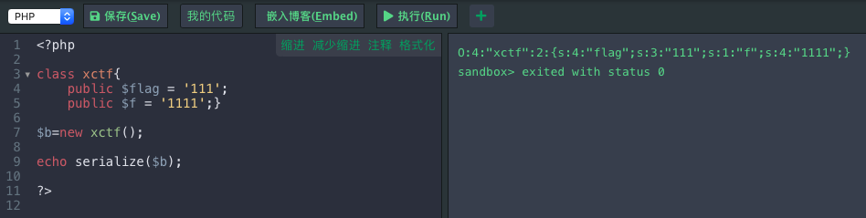

# Web 安全

黑客利用网站操作系统的漏洞喝web服务程序的漏洞得到web服务器的控制权限，轻则篡改网页内容，重则窃取重要内部数据，更为重要的则是在网页中植入恶意代码，使得网站访问者收到侵害。

web类的题目包括但不限于:SQL注入，XSS跨站脚本，CSRF请求伪造，文件上传，文件包含，框架安全，PHP常见漏洞，代码审计等。

## 一. http状态码

- 200：请求成功
- 301：资源被永久转移到其他URL
- 404：请求的资源不存在
- 500：服务器内部错误

1**：服务器收到请求，需要请求者继续执行操作

2**：操作被成功操作处理

3**：重定向，需要进一步的操作以完成请求

4**：客户端错误，请求包含语法错误或者无法完成请求

5**：服务器错误，服务器在处理请求的过程中发生了错误

## 二. SQL注入

通过在用户可控参数中注入SQL语法，破坏原有SQL结构，达到编写程序时意料之外结果的攻击行为。其成因可以归结为以下两个原因叠加造成的：

1. 程序编写者在处理应用程序喝数据库交互时，使用字符串拼接的方式构造SQL语句
2. 未对用户可控参数进行足够的过滤便将参数内容拼接进入到SQL语句中

### 2.1 web 程序三层架构

1. 界面层
2. 业务逻辑层（加载编译并执行index.php）
3. 数据访问层（执行SQL语句）

业务逻辑层的web服务器从本地存储中加载index.php脚本并解析。脚本连接位于数据访问层中的DBMS，权限认证通过就会执行sql语句。

**sql注入带来的威胁**：

- 猜解后台数据库，盗取网站的敏感信息
- 绕过认证
- 注入可以借助数据库的存储过程进行提权等操作

使用注释符`#`，`-- （后面有空格）`，`/*多行注释*/`

使用or 和 and的判断语句，使得条件总是为真

- 都是利用了url中传递的参数条件进行攻击

### 2.2 SQL注入绕过技巧

- 绕过空格

  两个空格代替一个空格，用tab代替空格，%a0=空格；

  最基本的绕过方法，用注释替换空格。/**/

  `/**/union/**/`

- 括号绕过空格

  如果空格被过滤，括号没有被过滤，可以用括号绕过。

  在mysql中，括号是用来包围自查询的。因此，任何可以计算出结果的语句，都可以用括号包围起来。而括号的两端，可以没有多余的空格。

  ```mysql
  ?id=1%27and(sleep(ascii(mid(database()from(1)for(1)))=109))%23
  
  ```

  from for属于逗号绕过，下面会有。

- 引号绕过

  使用十六进制

  ```mysql
  select column_name  from information_schema.tables where table_name="users"
  ```

  ```mysql
  select column_name  from information_schema.tables where table_name=0x7573657273
  ```

- 逗号绕过

  使用from或者offset

  在使用盲注的时候，需要使用到substr(),mid(),limit.这些子语句方法都需要使用到逗号。对于substr()和mid()这两个方法可以使用from to的方法来解决：

  ```mysql
  select substr(database() from 1 for 1);
  select mid(database() from 1 for 1);
  ```

  使用join

  ```mysql
  union select 1,2     #等价于
  union select * from (select 1)a join (select 2)b
  ```

  使用like???

  ```mysql
  select ascii(mid(user(),1,1))=80   #等价于
  select user() like 'r%'
  ```

  对于limit可以使用offset来绕过：

  ```mysql
  select * from news limit 0,1
  # 等价于下面这条SQL语句
  select * from news limit 1 offset 0
  ```

- 比较符号（><)绕过

  使用greatest()、least()：前者返回最大值，后者返回最小值。greatest()接收多个参数，返回输入参数的最大值。

  ```mysql
  select * from users where id=1 and ascii(substr(database(),0,1))>64
  ```

  与下面这条语句等价：

  ```mysql
  select * from users where id=1 and greatest(ascii(substr(database(),0,1)),64)=64
  ```

  使用between and：

  between a and b：返回a，b之间的数据，不包含b。

- or and xor not绕过：

  ```mysql
  and=&& or=|| xor=| not=!
  ```

- 绕过注释符号（#，--(后面跟一个空格)）过滤（不懂）

  ```mysql
  id=1' union select 1,2,3||'1
  ```

  最后的or'1闭合查询语句的最后的单引号，或者：

  ```mysql
  id=1' union select 1,2,'3
  ```

- 绕过union, select,where等

  1. 使用注释符绕过：

     常用注释符：

     ```mysql
     //,--,/**/,#,--+,-- -, ;,%00,--a
     ```

  2. 使用大小写绕过

     ```mysql
     id=-1'UnIoN/**/SeLeCT
     ```

  3. 内联注释绕过

     ```mysql
     id=-1'/*!UnIoN*/ SeLeCT 1,2,concat(/*!table_name*/) FrOM /*information_schema*/.tables /*!WHERE *//*!TaBlE_ScHeMa*/ like database()#
     ```

  4. 双关键字绕过（若删除掉第一个匹配的union就能绕过）

     ```mysql
     id=-1'UNIunionONSeLselectECT1,2,3–-
     ```

  5. 等价函数绕过

     ```mysql
     hex()、bin() ==> ascii()
     
     sleep() ==>benchmark()
     
     concat_ws()==>group_concat()
     
     mid()、substr() ==> substring()
     
     @@user ==> user()
     
     @@datadir ==> datadir()
     
     举例：substring()和substr()无法使用时：?id=1+and+ascii(lower(mid((select+pwd+from+users+limit+1,1),1,1)))=74　
     
     或者：
     substr((select 'password'),1,1) = 0x70
     strcmp(left('password',1), 0x69) = 1
     strcmp(left('password',1), 0x70) = 0
     strcmp(left('password',1), 0x71) = -1
     ```

  6. 宽字节注入

     过滤`'`的时候往往利用的思路是将`'`转换为`\'`.

     看不懂。

     %df

## 三. XSS跨站脚本攻击

跨站脚本攻击（Cross Site Scripting）层叠样式表（Cascading Style   Sheets）

恶意攻击者在web页面中插入恶意HTML代码，当用户浏览该页时，嵌入其中web里面的html代码会被执行，从而达到而已攻击用户的特殊目的。

### 3.1 Cookies资料窃取

### 3.2 会话劫持

### 3.3 钓鱼欺骗


## 四. XXE(XML External Entity attack)

XML外部实体注入攻击

## 五. 命令执行

## 六. 文件包含

如果允许客户端用户输入控制动态包含在服务器端的文件，会导致恶意代码的执行与敏感信息泄露，主要包括本地文件包含和远程文件包含两种形式。


## 七. CSRF跨站请求伪造

在已登录用户不知情的情况下执行某种动作的攻击。比如可以在其不知情的情况下转移用户资金、发送邮件等操作。


## 八. SSRF服务器端请求伪造

是一种由攻击者构造形成由服务端发起请求的一个安全漏洞。一般情况下，SSRF攻击的目标是从外网无法访问的内部系统。

- **漏洞成因**

  SSRF漏洞就是通过篡改获取资源的请求发送给服务器，但是服务器并没有检测这个请求是否是合法的，然后服务器以他的身份来访问其他服务器的资源。

- **SSRF用途**

  1. 内外网的端口与服务扫描
  2. 主机本地敏感数据的读取
  3. 内外网主机应用程序漏洞的利用
  4. 内外网web站点漏洞的利用

- **远程文件包含（Remote File Inclusion）**

  - 文件包含的目的是：程序员在编写程序的时候，经常会把需要重复使用的代码写入一个单独的文件中，当需要调用这些代码时，再在其他文件中包含调用代码的文件。

  - php中常用的包含调用函数有：include()，require()，include_once()，require_once()。include失败会弹出警告，而require则直接导致致命的错误。

  - 例子：

    ```php
    <?php
    if(isset($_GET['file'])){
    $file = $_GET['file'];
    include($file);
    }
    ?>
    ```

    更加通俗的讲，就是把被包含的文件的代码拿过来当作自己源码的一部分，所以，php文件包含机制有一个特性：哪怕被包含的文件是一个txt文件，它也会被包含文件所在的服务器当作脚本去执行。

    所以说我们可以通过文件包含漏洞，写一个扫描目标主机端口的端口扫描脚本，再通过url参数传递得到端口扫描结果。

    


## 九. 文件上传

如果不对上传的文件进行限制或者限制被绕过，该功能便有可能会被利用于上传可执行文件、脚本到服务器上，进而导致服务器沦陷。


## 十. 点击劫持

是一种视觉欺骗的手段，在web端就是iframe嵌套一个透明不可见的页面，让用户在不知情的情况下，点击攻击者想要欺骗用户点击的位置。


## 十一. VPS虚拟专用服务器


## 十二. 条件竞争

条件竞争漏洞是一种服务器端的漏洞，由于服务器端在处理不同用户的请求时时并发进行的，因此，如果并发处理不当或者相关操作逻辑顺序设计不合理时，将会导致此类问题的发生。


## 十三. 越权


一个账户即可控制全站用户数据。开发人员在对数据进行增删改查时对客户端请求的数据过分相信而遗漏了权限的判定。

 ## 十四. 序列化和反序列化

序列化是将对象转换为字节序列的过程，而反序列化则是将字节序列转换成目标对象的过程。

序列化：将对象转换为**便于传输**的格式，常见的格式：二进制格式、字节数组、json字符串、xml字符串



如上图所示，java对一个创建的对象b序列化之后，得到的是结果：

`O:4:"xctf":2:{s:4:"flag";s:3:"111";s:1:"f";s:4:"1111";}`

其中，`o:4`表示的是一个object对象，包含4个长度的字符串，接下来的2表示，这个对象中有两个变量；大括号里面的是描述两个变量的信息，其中`s:4:"flag"`表示的是flag是一个string类型然后长度是4，如果是一个数字的话，直接`i:7`，表示这个数字是7.

