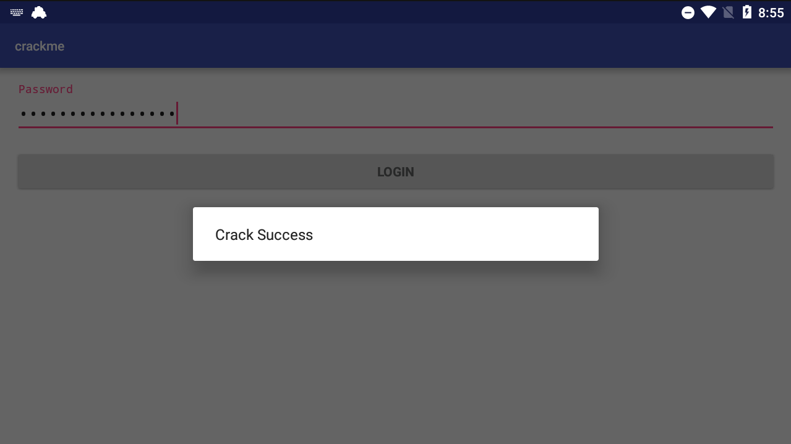

# apk:yzdd_crackme


> challenge name, file name: crackme.apk
>
> description / hint: 答案有多解，给出一个可见字符串即可。主要是分析一个`.so`文件
>
> `libprotect.so` and `libprotect.so.idb` provided
>
> `DES.py`: PBKDF1 and DES (calculate block 3 cipher text)
>
> `libso_xor.cpp`: libprotect.so里对rhs的逻辑实现和逆向
>
> `xxx.java`: apk中对user input加密过程及逆向(解密)的实现，爆破4B并调python计算block 3 cipher text
>
> 2021 job interviews

apk整体逻辑：

1. 输入(4,16]个字符，java层用PBEWithMD5AndDES做加密，DES+CBC+PKCS5Padding。如果输入为16B，则输出24B密文，encode为hex str形式后为48B
2. `libprotect.so`接收48Bhex str形式的密文，取前一半(24B)做decode，与一固定数组做xor后encode(24B)
3. 最后与一个计算得到的24B字符串`lhs`做对比，值应相等。lhs由bss区上的字符数组计算得到，每次运行不变。

# Analysis Procedure

由hint可知，flag不唯一，题目中可能存在hash/冗余的情况，且重点在`.so`。

拿到apk后，zip解包，找到`libprotect.so`，注意用`.\lib\armeabi-v7a\libprotect.so`，arm高版本用的，虽然逻辑整体一致，但伪代码看起来略有不同。`libprotect.so`主要是把传入的一个字符串做一点变换之后，与一个固定的、由bss区数据生成的字符串`lhs`对比，若相同则success。

IDA动态调试绕ptrace反调试之后就可以看到`lhs`的值，但发现传入的字符串与在app输入的内容（以后简称user input）不一样，且前16B与user input的前8个字符对应，传入so的字符串为16B的倍数，明显为块加密。

分析apk中java代码调用`libprotect.so`前的代码，发现调用`PBEWITHMD5andDES`。`PBEWITHMD5andDES`是CBC+PKCS5Padding的DES，DES算法的key和IV由PBKDF1(passwd, salt, itercount, 16)计算得出。若user input长度为16，会得到24B的密文，转成hexstr表示后有48B，`libprotect.so`中取一半，即24B，从hexstr表示转成bytes形式(c++中仍为`char*`)，有12B，然后与bss区的一个32B table做异或，便成为最终的`rhs`。最后对比：`strcmp(lhs, rhs)`

> hexstr表示形式：瞎造的名字，是想表达`\x1f`这种不可读字符（本wp称为bytes形式）转换为可读的两个字符`1f`的这种表示形式。

# Solution

1. IDA真机调试，nop掉ptrace反调试函数调用，在最后`strcmp(lhs, rhs)`处断下，得到`lhs`的值。目标：`lhs == rhs`
2. debug了解清楚字符串传入so后的处理过程，将`lhs`逆回刚进入so时的值。得到24B hexstr形式的密文
   - so处理时会将传入的hexstr的前面一半还原为bytes后做一轮xor
   - 而`lhs`逆回去的hexstr形式为24B，后面一半要被截掉，故初始的应有48B
   - java中的DES加密得到的一组密文(8B)对应so中的16B，所以如果要得到48B的hexstr形式的密文，明文长度至少为16，算上PKCS5Padding，24B plain text(with padding) -> 24B encrypted -> 48B hexstr
   - hexstr前24B固定，后24B不用，故爆破plain text需要爆破hexstr形式的24B。但实际只需爆破hexstr 8B，后16B是可以计算出来的
3. 分析调so前java代码，理清加密算法的过程，利用逆向出来的`passwd, salt, itercount`计算出key, IV。爆破：
   - 实现PBKDF1算法，得到key
   - 爆破第二组密文(8B)的后一半(4B)，这一组8B密文就是最后一组DES输入时与明文做xor的IV
   - PKCS5Padding导致最后一组明文是8个`\x08`，IV由上一步得出，key已计算得出，可以得到最后一组密文
4. 爆破时，判断得到的明文是否全为可见ascii，是则为最终的flag

> Q: 为什么不能用虚拟机调试?
>
> A: x86 OS的安卓虚拟机在运行arm指令时，会将arm指令翻译成等价的x86指令再执行，所以在虚拟机里下断点时，断点是下在arm版的so上的，但实际上虚拟机执行的是翻译后的x86指令，就无法走到该断点了

# libprotect.so


## Anti ptrace Anti-Debug

ptrace anti-debug procedure:

1. `.text:00001D88`的函数先fork()，父进程记录子进程pid，子进程轮询当前进程的TracerPid，并且写入到一个.bss的变量`bss_tracer_pid`上。
2. 在`.text:00001D88`函数前创建了一个管道`pipe(&before_bss_tracer_pid);`，使得`bss_tracer_pid`的值能够传递到前面4B
3. 然后`pthread_create`创建了一个线程，该线程如果检测到`before_bss_tracer_pid`不为0，则会kill当前进程，以及`.text:00001D88`的函数fork出来的子进程


反ptrace反调试的其中一个途径：nop掉`.text:00001D88`函数的调用，这样`bss_tracer_pid`就不会被赋值了，自然也不会触发kill了。具体过程：

1. IDA attach上crackme进程后，在protect.so的`Java_com_yzdd_crackme_LoginActivity_check`函数Add breakpoint
2. F9 continue，直至在`Java_com_yzdd_crackme_LoginActivity_check`起始地址断下，然后找到call/BLX`0x00001D88`的地方，将其nop掉，两种方法：
   1. Patch program->change bytes: 把对应的 `BLX sub_xxx88`的4B改成`00 BF 00 BF`
   2. Keypatch (ctrl+alt+K): assembly里填nop; nop，因为要对应原本4B长的机器码（貌似以前x86会自动对齐？注意按一次ok后点cancel，不然一直patch下去）
3. F9 continue，可以正常执行到后面的语句，Anti ptrace Anti-Debug SUCCEED

## Get const string `lhs`

得到`lhs`值的过程：

1. IDA attach, modules找到`libprotect.so`，双击，给`Java_com_yzdd_crackme_LoginActivity_check`新增断点
2. F9 continue, 真机中输入16个字符，点 LOGIN，然后会在so中断下
3. 将ptrace的`BLX` nop掉，在`strcmp(lhs, rhs)`处断下
4. 右侧寄存器窗口看R0指向地址的值，即为`lhs`的值

IDA中，`strcmp`调用处的汇编如下。动态调试时，无法分析出函数名为`strcmp`

```assembly
.text:000022FC 30 46           MOV     R0, R6  ; char *
.text:000022FE 51 46           MOV     R1, R10 ; char *
.text:00002300 FF F7 B0 E8     BLX     strcmp  ; Branch with Link and Exchange (immediate address)
```

> strcmp R0: 用于对比的const字符串`lhs`: `16D71D14B3F9B6519A28AB54, len=24`   

## .so Logic: `LoginActivity_check`

原型可能为：

`JNIEXPORT jstring JNICALL Java_com_yzdd_crackme_LoginActivity_check(JNIEnv *env, jclass cls, jstring j_str)`

```cpp
c_str = (*env)->GetStringUTFChars(env, j_str, 0); // Java字符串转C/C++字符串, 0表示返回原字符串的指针
// 做了ptrace反调试 检测 TracerPid 写入一个bss地址上 
// 另有一个线程 如果TracerPid不为零 kill 当前线程及parent线程
rhs = rhsFunc(c_str) // 对传入的字符串做的唯一操作
// 接下来构造一个字符串lhs 动态调试发现lhs每次都不变 看伪代码可以发现是利用.rodata上的数据来构造的
strcmp(lhs, rhs) // debug的目的就是断在这，得到lhs的值
```

对于lhs来说，`Java_com_yzdd_crackme_LoginActivity_check`做了一大堆操作，bss区出现了AES的sbox, isbox, rcon，但是如果debug得到了`lhs`的值，`lhs`相关的所有操作都不需要看了。

`rhs` .so中的处理过程:

1. 先调用`c_str = (*env)->GetStringUTFChars(env, j_str, 0);`将传入的java String转成`char* inStr`
2. `rhs = rhsFunc(inStr);` `inStr`是hex str表示的48B长的`char*`
   1. `hex2bytes(inStr, inStrLen >> 1, tmpStr);` 截取一半，输出存在`tmpStr`
   2. xor: `sprintf(hexStr, "%02X", B2 ^ B1); strcat(outStr, hexStr);` B1是一个bss区的`char[]`, B2是`tmpStr[i]`
3. `strcmp(lhs, rhs)`

所以只需要得到`lhs`的值，即`rhs`的目标值，就可以将上面的`rhs`处理过程逆过来，得到传入so的目标值（48B的前24B）

>  `libprotect.so`逻辑的一个样例
>
>
> ```python
> # 用户输入为16个0 0000000000000000
> # libprotect里的输入如下 
> "480E1C995149230BC5DF87EEB25E2F8A4B01B9F307391E35"  # len=48
> # 传入前半，即24B；经过 hex2bytes 函数运行完之后的结果: 
> 0x48, 0xE, 0x1C, 0x99, 0x51, 0x4 9, 0x23, 0xB, 0xC5, 0xDF, 0x87, 0xEE # len=12B
> # 最终  // 因为最后会做一轮 sprintf(hex_num, "%02X", B2 ^ B1); 所以长度x2
> 0x35, 0x32, 0x30, 0x32, 0x33, 0x31, 0x38, 0x35, 0x35, 0x45, 0x34, 0x34,
> 0x31, 0x44, 0x30, 0x41, 0x46, 0x37, 0x35, 0x37, 0x35, 0x34, 0x43, 0x44 # len=24B
> # 也就是说，要上上面这个rhs(24B)与lhs: "16D71D14B3F9B6519A28AB54" (24B) 的值相同
> # 验证首字节运算过程:
> print(hex(0x48^0x1A)) # 0x52  # 0x35='5', 0x32='2'
> ```
>


## Reverse lhs

rhs在so中核心操作只有xor，很容易逆回去，写出一个逆函数，输入为`16D71D14B3F9B6519A28AB54`(24B)，部分源码:

```cpp
unsigned char bssHashXorTable[33] = {0x1A, 0x0C, 0x2D, 0x1C, 0x0F, 0x0D, 0x3E, 0x01, 0x32,
                                     0x88, 0xD3, 0x23, 0x87, 0xAD, 0xEA, 0x82, 0x99, 0xAB,
                                     0x01, 0x32, 0x87, 0x98, 0x34, 0x83, 0x82, 0x32, 0x13,
                                     0x15, 0x16, 0x82, 0x19, 0x29, 0x0};
string bytes2hexstr(char* inStr) {
    char outStr[128];
    char tempStr[8];
    memset(outStr, 0, sizeof(outStr));
    memset(tempStr, 0, sizeof(tempStr));
    for (int i = 0; i < strlen(inStr); i++) {
        unsigned num = (unsigned char)inStr[i];
        unsigned firstDigit = num / 16;
        unsigned secondDigit = num % 16;
        if (firstDigit <= 9) {
            tempStr[0] = firstDigit + '0';
        } else {
            tempStr[0] = firstDigit + 55;
        }
        strcat(outStr, tempStr);

        if (secondDigit <= 9) {
            tempStr[0] = secondDigit + '0';
        } else {
            tempStr[0] = secondDigit + 55;
        }
        strcat(outStr, tempStr);
    }
    return string(outStr);
}
string REHashFunc(const char* instr) {
    unsigned char* pXorTable = bssHashXorTable;
    char outStr[128];
    memset(outStr, 0, sizeof(outStr));
    string ret;
    size_t LEN = strlen(instr);
    for (int i = 0; i < LEN; i += 2) {
        char temp[3] = {instr[i], instr[i + 1], 0x0};
        int num = strtol(temp, NULL, 16);
        temp[0] = (char)num;
        temp[1] = '\0';
        strcat(outStr, temp);
    }
    for (int i = 0; i < strlen(outStr); i++) {
        outStr[i] = outStr[i] ^ pXorTable[i];
    }
    ret = bytes2hexstr(outStr);
    return ret;
}
int main() {
    string lhs("16D71D14B3F9B6519A28AB54"); // 最后用于strcmp(lhs, rhs)的字符串lhs
    printf("[lhs] %s, len= %u\n", lhs.c_str(), lhs.length());
    ret = REHashFunc(lhs.c_str());
    printf("[REHash] %s, len= %u\n", ret.c_str(), ret.length());
    
    string lhs_ori = "0CDB3008BCF48850A8A07877000000000000000000000000";  // 16+16+16 48 B
    printf("[lhs_ori] %s, len= %u\n", lhs_ori.c_str(), lhs_ori.length());
    ret = HashFunc(lhs_ori.c_str());
    printf("[lhs_ori] after xor: %s, len= %u\n", ret.c_str(), ret.length());
    printHex(ret.c_str());
}// Output:
[lhs] 16D71D14B3F9B6519A28AB54, len= 24
[REHash] 0CDB3008BCF48850A8A07877, len= 24
[lhs_ori] 0CDB3008BCF48850A8A07877000000000000000000000000, len= 48
[lhs_ori] after xor: 16D71D14B3F9B6519A28AB54, len= 24
[hex] 31, 36, 44, 37, 31, 44, 31, 34, 42, 33, 46, 39, 42, 36, 35, 31, 39, 41, 32, 38, 41, 42, 35, 34,  len= 24
```

结果说明：目标是让传给so的字符串是`0CDB3008BCF48850A8A07877000000000000000000000000`(48Bytes)，其中后半段可以为任意`0~F`

> `0CDB3008BCF48850 A8A0787700000000 0000000000000000`  48B 对应3组密文
>
> `0CDB3008BCF48850 A8A07877`                       24B 对应1.5组密文，后面8B是需要爆破的
>
> `0CDB3008BCF48850`                                       16B 是第一组密文


# APK Java Logic

jeb中分析`com.yzdd.crackme`下的class，除了`LoginActivity`外全都做了混淆，大部分显示a, b, c, d...，介绍时用重命名后的

`LoginActivity`:

- `private boolean varify_len(String arg6)`要求输入长度大于4，小于等于16
- 有个函数调了`getText`，并new了一个class，再`execute`，应该是调处理user input的方法

`class_for_modify_user_input`:`LoginActivity`中new的，处理user input并调`libprotect.so`的class

- 接收user input，并初始化一个常量`PBEWITHMD5andDES`
- 有个函数，依据传入的`Boolean`值，传递`password error`或`Crack Success`去调接口

调libprotect.so前，apk中java代码做的主要操作:

1. 调PBEWITHMD5andDES对user input做加密
2. 将加密结果转换为hex str的形式

部分源码：

```java
import javax.crypto.Cipher;
import javax.crypto.SecretKeyFactory;
import javax.crypto.spec.PBEKeySpec;
import javax.crypto.spec.PBEParameterSpec;
import java.net.URLEncoder;
import java.security.Key;
import java.security.spec.AlgorithmParameterSpec;
// PBEWITHMD5andDES Google AndroidN 为常量String/bytes // import只写了部分
// 获取密钥工厂 生成密钥
Key key = SecretKeyFactory.getInstance(this.PBEWITHMD5andDES).generateSecret(new PBEKeySpec(Google));
// 传递salt和迭代轮次50
PBEParameterSpec params = new PBEParameterSpec(AndroidN, 50);
// 获取加密算法实例 并初始化为加密模式(1)，传递密钥、算法参数
Cipher cipher = Cipher.getInstance(this.PBEWITHMD5andDES);
cipher.init(1, key, ((AlgorithmParameterSpec) params));
// 对用户输入进行加密
byte[] encrypted = cipher.doFinal(user_input);
// 将加密后的byte[] 转换为 hex str表示的String，故长度X2
String hexed = buildToHex(encrypted);
String finalStr = URLEncoder.encode(hexed, "UTF-8"); // 实际没有作用，原本就是UTF-8编码
```


## PBEWithMD5AndDES and rfc8018

> rfc8081:  https://datatracker.ietf.org/doc/html/rfc8018  
>
> PKCS #5: Password-Based Cryptography Specification Version 2.1

Google PBEWithMD5AndDES后看到说这个算法用的是rfc8081。网站部分内容：

Note that this algorithm(PBEWITHMD5andDES) implies **CBC** as the cipher mode and **PKCS5Padding** as the padding scheme and cannot be used with any other cipher modes or padding schemes.

PBEWITHMD5andDES main process:

1. `DK=PBKDF1 (P, S, c, dkLen)`: 依据传入的passwd, salt, itercount, intended length，多次调用MD5算法得到DK
2. derived key: `DK`为16B, `Key = DK<0..7>, IV = DK<8..15>`
3. 使用标准的DES+CBC+PKCS5Padding做加解密

CBC Mode


PKCS5Padding

```c
If numberOfBytes(clearText) mod 8 == 7, PM = M + 0x01
If numberOfBytes(clearText) mod 8 == 6, PM = M + 0x0202
If numberOfBytes(clearText) mod 8 == 5, PM = M + 0x030303
...
If numberOfBytes(clearText) mod 8 == 0, PM = M + 0x0808080808080808 // 可以看到，不管怎样都得填充
```

> PKCS5Padding 只能用來填充 8 Byte (64bit）的Block，除此之外可以与PKCS7Padding混用
>
> 

rfc8018文档中，与本题目有关的加密过程叙述的一部分：

```c
5.1.  PBKDF1
   PBKDF1 (P, S, c, dkLen)

   Options:        Hash       underlying hash function

   Input:          P          password, an octet string
                   S          salt, an octet string
                   c          iteration count, a positive integer
                   dkLen      intended length in octets of derived key,
                              a positive integer, at most 16 for MD2 or
                              MD5 and 20 for SHA-1
   Output:         DK         derived key, a dkLen-octet string

          
6.1.1.  PBES1 Encryption Operation

   The encryption operation for PBES1 consists of the following steps,
   which encrypt a message M under a password P to produce a ciphertext
   C:

      1.  Select an eight-octet salt S and an iteration count c, as
          outlined in Section 4.

      2.  Apply the PBKDF1 key derivation function (Section 5.1) to the
          password P, the salt S, and the iteration count c to produce a
          derived key DK of length 16 octets:

                    DK = PBKDF1 (P, S, c, 16)

      3.  Separate the derived key DK into an encryption key K
          consisting of the first eight octets of DK and an
          initialization vector IV consisting of the next eight octets:

                    K   = DK<0..7>
                    IV  = DK<8..15>

      4.  Concatenate M and a padding string PS to form an encoded
          message EM:

                    EM = M || PS

          where the padding string PS consists of 8-(||M|| mod 8) octets
          each with value 8-(||M|| mod 8).  The padding string PS will
          satisfy one of the following statements:

                    PS = 01, if ||M|| mod 8 = 7 ;
                    PS = 02 02, if ||M|| mod 8 = 6 ;
                    ...
                    PS = 08 08 08 08 08 08 08 08, if ||M|| mod 8 = 0.

          The length in octets of the encoded message will be a multiple
          of eight, and it will be possible to recover the message M
          unambiguously from the encoded message.  (This padding rule is
          taken from RFC 1423 [RFC1423].)

      5.  Encrypt the encoded message EM with the underlying block
          cipher (DES or RC2) in CBC mode under the encryption key K
          with initialization vector IV to produce the ciphertext C.
          For DES, the key K shall be considered as a 64-bit encoding of
          a 56-bit DES key with parity bits ignored (see [NIST46]).  For
          RC2, the "effective key bits" shall be 64 bits.

      6.  Output the ciphertext C.

   The salt S and the iteration count c may be conveyed to the party
   performing decryption in an AlgorithmIdentifier value (see Appendix
   A.3).
```


## Brute Force: Analysis

- block2 plaintext: apk允许最多输入16B，即第二组明文可以用user input填满
- block3 plaintext: PKCS5Padding会把第三组明文填充为`0x0808080808080808`。<- block3 plaintext
- block1 ciphertext: 由前面reverse lhs得到目标的第1个cipher block为`0CDB3008BCF48850`
- block2 ciphertext: 第2个cipher block应该为`A8A0787700000000`，后半段的0未知，需要爆破。<- block3 IV

再看看CBC加密模式的图，可以知道block3 ciphertext的值可以依据block3 IV(block2 ciphertext), block3 plaintext, key计算得到，所以block3 ciphertext是不需要爆破的。实际需要爆破的是4B的密文，对应传入so后的8个hex number

但可惜的是，没有找到Java中有什么方法能直接得到生成的key，只有`cipher.getIV()`可以获取生成的IV值。无奈只能用python写PBKDF1去计算key了，`cipher.getIV()`的结果可以用于验证python计算出的key

> 爆破12B密文是不可能的，量级过大，后面8B在block2 ciphertext确定时，只有唯一解，强行爆破会疯狂爆`Exception:javax.crypto.BadPaddingException: Given final block not properly padded. Such issues can arise if a bad key is used during decryption.`

## PBKDF1

```python
def PBKDF1(password, salt, c, dkLen):
    dkMaxLen = hashlib.md5().digest_size  # md5: dkMaxLen=16
    assert(dkLen <= dkMaxLen)  # derived key too long
    assert(len(salt) == 8)  # Salt should be 8 bytes'

    T = hashlib.md5(password + salt).digest()
    for _ in range(2, c + 1):
        T = hashlib.md5(T).digest()

    return T[:dkLen]  # the derived key DK
DerivedKey = PBKDF1(b"Google", b"AndroidN", c=50, dkLen=16) 
# b'\xe7\x98\x07\x95\xf3\x8eb\xf7\x1b\xc4g\xbb\t\x80\xe6\xe6' output len = 16B 
```

- 得到`key = b"\xe7\x98\x07\x95\xf3\x8eb\xf7", IV=b'\x1b\xc4g\xbb\t\x80\xe6\xe6'`

> PBKDF1源码在`DES.py`里
>
> `DES.py`还包括DES，IV设定为block2 ciphertext, `key=b"\xe7\x98\x07\x95\xf3\x8eb\xf7", plaintext=b"\x08\x08\x08\x08\x08\x08\x08\x08"`, 源码修改自github某repo, 已经找不到是哪个了

## Brute Force: Crack

Brute Force Process:

1. java random: 随机生成8个hex number(对应4B密文)，补全block2 ciphertext
2. call python script: `python DES.py block2_ciphertext`，调python加密脚本，传block2 ciphertext
3. decrypt: 调`cipher.init(Cipher.DECRYPT_MODE, key, params);`然后解密
4. is it readable: 判断明文所有字符是否是可读ascii.
   - NOT readable: go Step-1; 
   - readable: get a flag

> 源码放在`xxx.java`文件里面

# flag

```
flag{A!k9;'eu,EH
flag{A!k+5So$XR}
flag{A!k{Sr*o@O.
flag{A!kQyNbmqdi
flag{A!k=!WTmNe-
flag{A!k[$'+)J#7
flag{A!kU5j>ouTh
... more answer ...
```



# Postscript

这~~可能~~是gugugu最久的一题，如果咕wp不算咕的话......gu的主因除了当前主业进度不堪外，主要是因为第一次做安卓题，对安卓和java都不懂，容易陷入一些无关紧要的代码里。

这题可能适合作为安卓的中等综合题，原因如下：

- 对设备有要求，必须为真机调试。除非硬磕lhs的处理过程
- 需要有一定密码学基础，了解块加密，看得懂文档（或者身边有大佬看得懂文档也行）。看懂并修改标准加密流程
- 需要学会绕ptrace反调试
