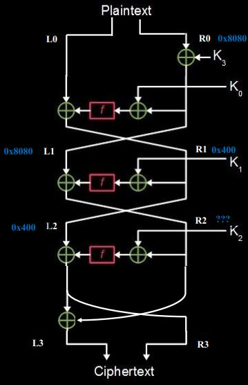

# 2021年“天翼杯”—— Crypto —— MyCipher

题目见`MyCipher.py`，太长就不贴在这里了

这道题是一道基于feistel结构的加密算法，密钥长度为8字节。用随机生成的密钥对flag进行了加密。攻击者可以提供一段明文让服务器用同样的密钥进行加密
密钥长度为8字节，直接爆破的复杂度为2^64,是不太现实。

题解：
这道题有两种解法

* 官方解法
    这道题和 FEAL(Fast data Encipherment ALgorithm)块加密算法比较的类似，可以说论函数几乎一模一样。
    参考：http://www.theamazingking.com/crypto-feal.php
    本质上是对此算法进行**差分密钥分析**进行攻击。
    首先我们寻找差分性质：
    ```python
    def find_differential():
        for i in range(0x10000):
            diffs = {}
            for j in range(0x100):
                input1 = random.randint(0, 0xffff)
                input2 = input1 ^ i
                output1 = f(input1)
                output2 = f(input2)
                diff = output1 ^ output2
                if diff in diffs.keys():
                    diffs[diff] += 1
                else:
                    diffs[diff] = 1
            for k in diffs.keys():
                if diffs[k] >= 60:
                    print(hex(i)[2:], hex(k)[2:], diffs[k])
    ```
    然后发现差分信息最大的是当两个输入的差分为`0x8080`的时候，两个输出的差分为`0x400`。因此可以利用这个的差分性质进行攻击。
    
    1. 首先对第三轮密钥进行分析，我们构造两个特殊的输入 (L0，R0)和 （L0',R0')其中 L0 = L0'， R0 = R0' ^ 0x8080,让服务器加密，得到加密结果 (L3,R3),(L3',R3').通过对该加密算法的推导，我们可以得到关于第3轮轮函数f的运算关系。
    
    其中蓝色字表示100%拥有的差分关系。然后我们现在知道了L3和R3，虽然我们不知道R3的差分关系，但是我们可以知道第三轮的轮函数f的输入(K2  ^ L3 ^ R3)，也知道第三轮论函数的输出R3。因为在密钥K2变化的时候R3的差分一般来说是均匀分布，因此暴力枚举K2，使得f(K2 ^ L3 ^ R3)的差分结果等于R3的差分结果异或0x400，则该密钥很有可能就是加密时的K2（这里的0x400是R1的差分结果，必定成立）。

    2. 然后对第二轮密钥进行分析，我们构造两个特殊的输入 (L0，R0)和 （L0',R0')其中 L0 = L0'， R0 = R0' ^ 0x400,让服务器加密，得到加密结果 (L3,R3),(L3',R3'). 这里进行异或0x400只是一个标记，理论上设置一个差分隐私不要太大的数据就可以，保证第二轮的密钥不会出太多种情况。
    首先我们需要获得第二轮轮函数的输入和输出。需要根据上一步中得到的第三轮的密钥进行恢复。然后同样使用暴力枚举K2的原理暴力枚举K1，从而得到了K1的候选密钥。

    3. 对第一轮密钥的恢复就不需要使用差分了，因为是第一轮。使用第二轮构造的输入和输出。然后使用第1、2步中恢复出的候选密钥K1，K2对轮函数恢复出第一轮轮函数的输入输出，然后暴力枚举K0，如果发现输入等于输出，那就表示找到了密钥K0，**不需要使用差分信息**。

    然后三轮密钥都恢复出来了，从而可以得到初始密钥。然后就可以对密文进行解密。可能会出现多组密钥的情况，以防万一可以每一组密钥都解密一遍。

    代码见：`Official_solution.py`
    参考链接：https://mp.weixin.qq.com/s/IowuiwBIfaV4AldqrXjmCQ

* 另一位老哥的解法：
    因为加密过程比较的简单，可以使用`z3`进行求解。
    代码见：`ZMJ_solution.py`
    参考链接：https://zhuanlan.zhihu.com/p/413319231