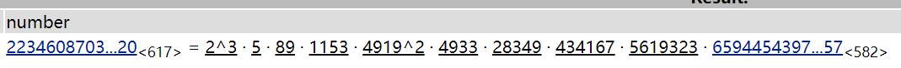

## 2021_*CTF--little_cast
## 比赛日期：2020年12月26日

## 题目
有1个python文件``challenge.py``和1个数据文件``out.sage``。
```py
# challenge.py
from Crypto.Util.number import *
from libnum import *
from secret import flag,special,p,q,n


def little_trick(msg):
    p1 = getPrime(1024)
    q1 = getPrime(1024)
    n1 = p1 * q1
    d1=random.randint(1,2**256)
    e1=inverse(d1,(p1-1)*(q1-1))
    print(n1)
    print(e1)
    print(pow(msg,e1,n1))


def real_trick():
    assert (special > (ord("*")*100) and gcd(special,(p-1)*(q-1))!=1 )
    print(n)
    print(pow(libnum.s2n(flag),special,n))


if __name__ == '__main__':
    little_trick(p-1)
    real_trick()
```

## 解题

* **原writeup：https://blog.csdn.net/cccchhhh6819/article/details/112766888**

1. 题目首先使用一个``little_trick``函数来加密``p-1``。然后观察该函数发现：它是一个RSA加密，其中解密指数``d1``是256bit，而其模数``n1``是2048bit。满足$d1<\frac{1}{3}n1^{\frac{1}{4}}$因此可以直接使用**WienersAttack**把``d1``恢复出来，然后得到``p-1``的明文。

2. 接下来观察``real_trick``函数，它保证了加密指数大于4200，然后加密指数与$\varphi(N)$并不是互素的。然后既然我们从步骤1中知道了``p-1``，因此很容易计算出$\varphi(N)$。然后对$\varphi(N)$进行分解，并计算``gcd(p-1, q-1)``。然后通过观察发现``gcd(p-1, q-1) = 9383 = 2*4919``于是猜测``special``就是4919。(至于为什么要这样猜我也不太懂，先这样猜测吧)

3. 既然猜测到``special``，而且``special``是整除$\varphi(N)$的。接下来就要对方程$$c\equiv m^{special}\ mod\ N \tag{1}$$开$``special``次根。这里用到了4.10中的**Adleman-Manders-Miller rth Root Extraction Method**算法。由于方程有``special^2``个根，因此我们需要对每个根进行判断，题目中说flag的开头是``*CTF``，因此对于每个根，我们需要判断其是否以``*CTF``开头。

* **WienersAttack**算法和**Adleman-Manders-Miller rth Root Extraction Method**算法都有在 **[CTF]_Crypto.md**文件中涉及，也提供了相应的代码。

### 主要步骤

1. 首先使用**little_cast.py**中的代码恢复出
``d1=36167461773898995192586226632578677184913220227461899855497899052924496298787``
然后计算出
``p=199138677823743837339927520157607820029746574557746549094921488292877226509198315016018919385259781238148402833316033634968163276198999279327827901879426429664674358844084491830543271625147280950273934405879341438429171453002453838897458102128836690385604150324972907981960626767679153125735677417397078196059``

2. 然后计算出$\varphi(N)$的值，$\varphi(N)$的分解如下：

接下来很多writeup都说看到一个``4919^2``，然后就猜测``special``是4919。有的writeup说``gcd(p-1, q-1) = 9383 = 2*4919``于是猜测``special``就是4919。

3. 通过程序**AMM.sage**，对方程(1)开``special``次根，并找出以``*CTF``开头的那个根，运行结果如下。
```
Start time: 0.0
P roots found: 15.898589134216309
Q roots found: 29.44992470741272
mp found: 31.3552885055542
mq found: 32.685569047927856
mps found: 32.96103000640869
mqs found: 33.379985332489014
b'*CTF{S0_Y0u_ARE_REA11Y_GOOd_At_Pla1_This}Ifyoumissthetrainimonyouwillknowthatiamgoneyoucanheartheflagfluwwwwwwwwww'
5715792447162584004830995621288196364667316788985719423575200593843082226610550301623816157835166569193582787431644910982754181340491582409788340367828925355394884518044538804653367543125682677650052644197537897019515168750419392615178911318381369421233129629180441067485047
solution found: 737.0463244915009
```
因此``*CTF{S0_Y0u_ARE_REA11Y_GOOd_At_Pla1_This}``就是flag。