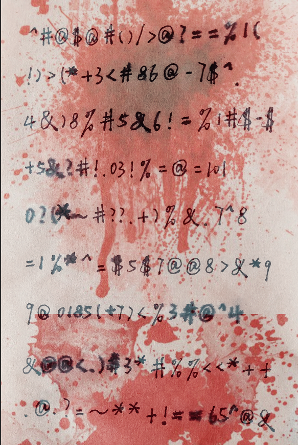
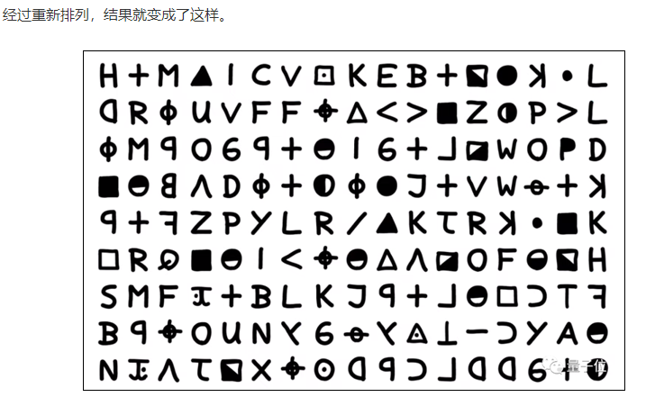
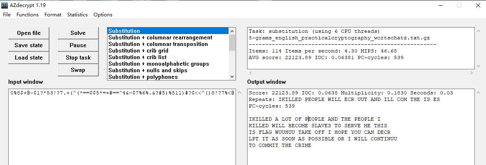

## 题目
但愿你能解出密文，不然我就会继续犯罪:)
本题获取flag提交前请加上flag{}
然后附件是一张图片

## 解题
因为题目中给的是一张图片，而且没有写明是Crypto而是fungame，因此这里不排除隐写的可能性。不过题目已经说了要解出密文，因此首先只往Crypto的方向去想。

在我解题的过程中，首先想的方向是普通的代换密码，因为题目中出现了很多的运算符，而且括号都是成对的，所以我一开始往数学公式方面想。然后发现非常的没有规律（算了还是不要硬想）。然后发现了图片中每一行的符号数量都是相等的，如果真的是数学公式，那么第5行最后的数字应该就要和第6行的数字连起来而不是分开。因此这里一定有什么特殊的潜在规律。

再看了一遍题目，题目中提到了十二宫这个名字，而且有弄了张带血的图片，如果仅仅是要解密的话不会弄这些花里胡哨的东西。而且按照古典密码的规律，代换密码一般题目中会给额外的提示告诉我们是哪一种古典密码。因此我们直接去网上搜十二宫。

一搜发现还真的有与十二宫这个人相关的密码。然后参考下面这个链接解释的方法：https://news.mydrivers.com/1/729/729319.htm

> 其密码首先需要对一个成9行17列的一个密文矩阵进行下面的置换操作：


接下来使用AZdecrypt这个软件就能得到相应的部分明文信息。

---
因此我们首先对我们的密文矩阵也进行相应的代换操作得到一个新的密文矩阵。然后把新的密文矩阵按行从上到下进行拼接，从而得到一串密文。再把密文放到AZdecrypt这个软件中跑，flag就出来了。

#### 实现步骤
* 首先是进行代换操作，使用python进行实现。**环境为python2.7**
```python
import numpy as np


def SHIFTdecrypt(m):
    x, y, a, b, count = 0, 0, 0, 0, 0
    result = [[0 for i in range(17)] for j in range(9)]
    while count < 153:
        result[a][b] = m[x][y]
        x, y = (x + 1) % 9, (y + 2) % 17
        a += (b + 1) // 17
        b = (b + 1) % 17
        count += 1
    return result


def Print_matrix(m):
    prm = [''.join(ll) for ll in m]
    for ll in range(9):
        print prm[ll]


if __name__ == '__main__':
    # s 为密文
    s = '^#@$@#()/>@?==%1(' \
          '1)>(*+3<#86@-7$^.' \
          '4&)8%#5&6!=%1#$.$' \
          '+5&?#!.03!%=@=101' \
          '0?(*~#??.+)%&.7^8' \
          '=1%*^=$5$7@@8>&*9' \
          '9@0185(+7)<%3#@^4' \
          '&@@<.)$3*#%%<<*++' \
          '.@.?=~**+!==65^@&'
    l = list(s)
    matrix = [l[i * 17:(i + 1) * 17] for i in range(9)]
    nex = SHIFTdecrypt(matrix)
    result = []
    for i in nex:
        result += i
    print ''.join(result)

    # 然后使用AZdecrypt软件进行代换密码的破解就可以直接得到flag
```
输出结果为：
```
^>%..@3*&#(#0+@#+.@*53)8@+@$+&!%>^&.@36%&&4@?#<!=.*9@=(#=@79@<~)8%=^=0.*/611811)*>@#00%8$+@-$1?*53!?7.+(^(*==$$5*=+#==^4&~$7%6%.&?#5)%511)#?$<<^()8!?7%<@
```

* 使用AZdecrypt软件解密（**下载地址：http://www.zodiackillersite.com/viewtopic.php?f=81&t=3198**）


在第三行可以看到
```
FLAG WUUHUU TAKE OFF I...
```
所以最后的flag就是flag{WUUHUUTAKEOFF}。
一开始我还以为只是flag{WUUHUU}，卡了我半个小时，最后一个一个单词去试，然后就成了。