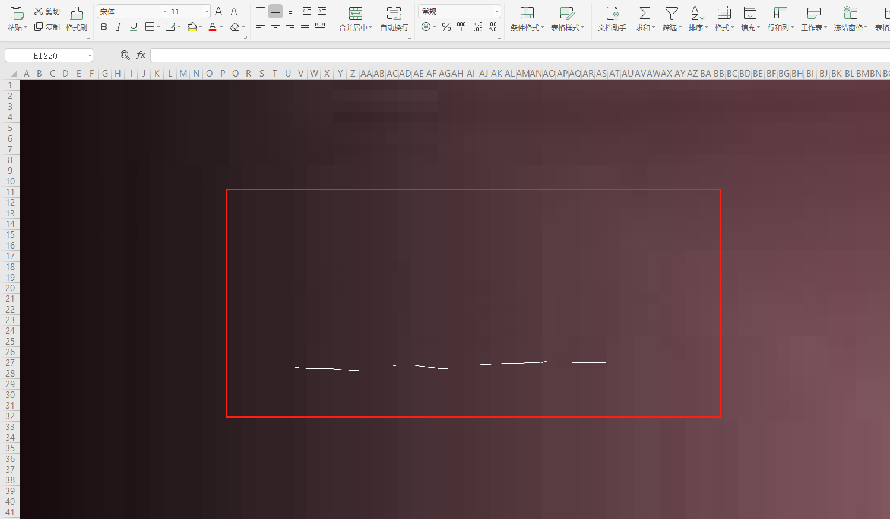

# s34hunka

> 2020 12 23 https://huaweictf.xctf.org.cn/
>
> original writeup: https://www.xctf.org.cn/library/details/55599c9c17ea0e8ca0b094adbe075a03a7321599/

题目描述：在excel中画画

>  相关文件: s34hunka.xlsx

表格形式：excel中每个单元格cell被填充了颜色，呈现出一张图。每个像素的颜色是每个单元格的背景色。

# Information Retrieval

- 放大仔细观察图片左上角有隐隐约约的flag字样（我眼瞎 没看到 猜测在这 不知道是不是 建议找像素眼来观察）



- 在文件属性处可以看到作者与标题。
- 堀内辰男，日本长野人，退休后想到了在电脑上用Excel来作画的金点子，创作出了一幅幅精美的日式风格山水风景画作


google image搜索s34hunka，可以在如下网站找到原图

- www2.odn.ne.jp
- http://www2.odn.ne.jp/~cbl97790/shinsakutenjishitu2.htm
- Find the original picture(`s34hunka.jfif`) at the site above. 

s34hunka.jfif:


# flag Extraction

```python
from PIL import Image
from openpyxl import load_workbook

img = Image.open('s34hunka.jfif')
pixels = img.load()
width, height = img.size

wb = load_workbook('s34hunka.xlsx')
ws = wb.active

for j in range(height):
    for i in range(width):
        c = ws.cell(j + 1,i + 1)
        p = pixels[i,j]
        color = ''.join('%02X'%t for t in p)
        if color == c.fill.fgColor.rgb[2:]:
            pixels[i,j] = (255, 255, 255)
        else:
            pixels[i,j] = (0, 0, 0)
            
img.save("myresult.png")
```

- Script execution result:


- flag:    `flag{Let'5_P41nt_wI7h_eXcEl}`


这题做不出的主要原因是，第一次接触这类型的题（翻译一下：太菜了）。其实看到题目这么奇怪，就应该立即要素警觉，打开google搜索。看不到隐隐约约的flag都没关系，只要在google搜索到原图，相信还是能意识到将两幅图进行对比一下的，只要进行了对比，这题就做出来了。题目难度很小，分值在100以下。

