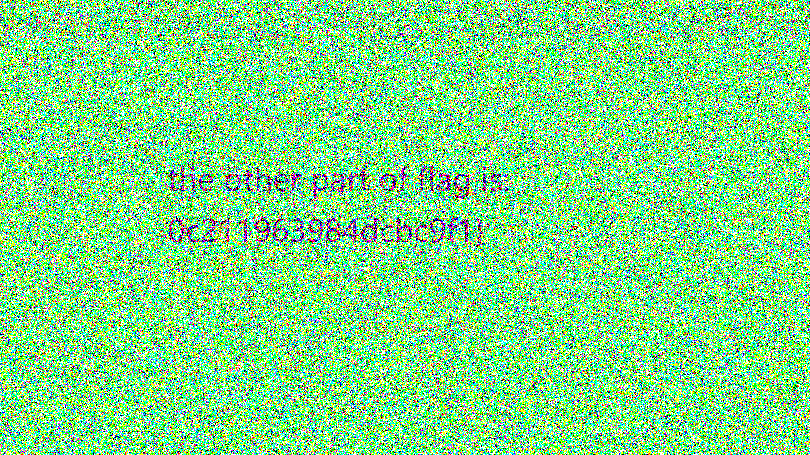

# image steganography DASCTF July X CBCTF 4th 2021 misc: ezSteganography

> DASCTF July buuoj.cn/das   **DASCTF July X CBCTF 4th**
>
> challenge name: ezSteganography
>
> file: ezSteganography-flag.png
>
> point: more than 20 solved, 831 points
>
> writeup writer: https://github.com/kokifish

1. StegSolve从R通道lsb看到hint：G通道有东西
2. StegSolve从G通道lsb提取出一个png图像，得到上半部分的flag与hint：QIM量化step=20可以得到另一部分的flag
3. github上找QIM量化提取水印的脚本，改step=20，得到下半部分的flag

题目比较简单，赛后讲解的时候，按出题人意思是要自己写脚本，但是github上是有现成python代码可以用的。应该很多人是卡在了QIM量化提取水印的脚本上。

# StegSlove: Hint and Extract a Png

用 StegSolve-1.4.jar 打开 ezSteganography-flag.png 之后，在软件下方的按钮点 ">" 到左上角显示 Red plane 0之后（即显示图片Red通道的lsb层的图像），得到提示"There are somethings in G plane"

StegSolve -> 菜单栏: Analyse -> 点击Data Extract -> 只勾选Green 0，点save bin，文件名命名为xxx.png，打开后可以看到flag的上半部分

在勾选完Green 0 之后，点preview其实已经可以看出端倪，预览框显示的内容的ASCII码有明显的PNG IHDR sRGB字样，可以猜出是个png图片。从该提取出的png图片可以看到flag的上半部分，并且提示说要用QIM量化，step is 20


# QIM Quantization

在github上搜QIM Quantization，用pl561的QuantizationIndexModulation repo:

https://github.com/pl561/QuantizationIndexModulation

看懂代码在做什么之后，改路径，改quantization step为20，保存提取的水印图片

```python
# Implementation of QIM method from Data Hiding Codes, Moulin and Koetter, 2005
from PIL import Image
import sys
import os

import numpy as np


class QIM:
    def __init__(self, delta):
        self.delta = delta

    def embed(self, x, m):
        """
        x is a vector of values to be quantized individually
        m is a binary vector of bits to be embeded
        returns: a quantized vector y
        """
        x = x.astype(float)
        d = self.delta
        y = np.round(x / d) * d + (-1)**(m + 1) * d / 4.
        return y

    def detect(self, z):
        """
        z is the received vector, potentially modified
        returns: a detected vector z_detected and a detected message m_detected
        """
        shape = z.shape
        z = z.flatten()

        m_detected = np.zeros_like(z, dtype=float)
        z_detected = np.zeros_like(z, dtype=float)

        z0 = self.embed(z, 0)
        z1 = self.embed(z, 1)

        d0 = np.abs(z - z0)
        d1 = np.abs(z - z1)

        gen = zip(range(len(z_detected)), d0, d1)
        for i, dd0, dd1 in gen:
            if dd0 < dd1:
                m_detected[i] = 0
                z_detected[i] = z0[i]
            else:
                m_detected[i] = 1
                z_detected[i] = z1[i]

        z_detected = z_detected.reshape(shape)
        m_detected = m_detected.reshape(shape)
        return z_detected, m_detected.astype(int)


if __name__ == "__main__":
    delta = 20  # quantization step
    qim = QIM(delta)

    img2 = Image.open("ezSteganography-flag.png")
    y = np.array(img2)
    z_detected, msg_detected = qim.detect(y)
    print("msg_detected:", msg_detected.shape, msg_detected)

    rescaled = (255.0 / msg_detected.max() * (msg_detected - msg_detected.min())).astype(np.uint8)
    im = Image.fromarray(rescaled)
    im.save('the_other_part_of_flag.png')

```

脚本运行完之后得到的图片如下，和上半部分的flag合并后即为最终的flag



