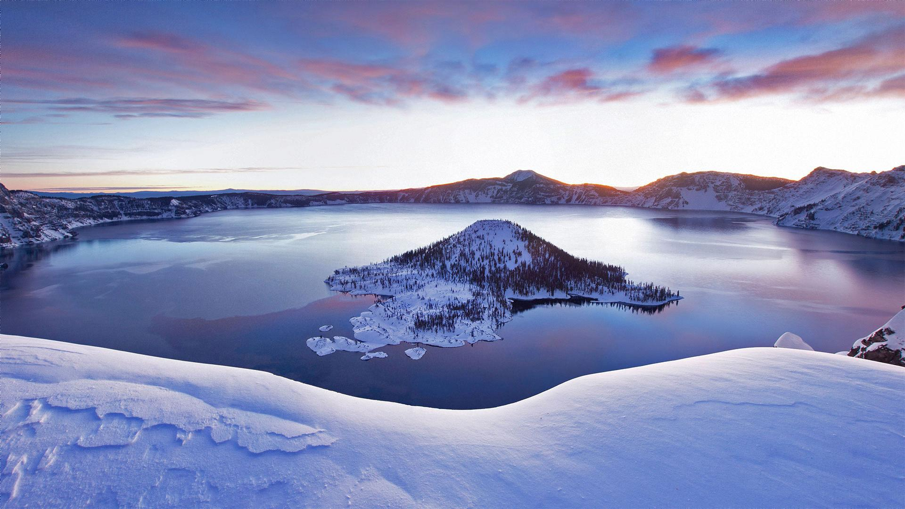

## 题目
> It's really cold this winter, can you find what is hidden in snow {{{(>_<)}}}

然后给出的图片只有snow文件夹中的snow.jpg文件


## 解题
只有一张图片，而且根据题目的意思，很大概率是隐写。于是参考链接

https://blog.csdn.net/u012486730/article/details/82016706

中的第三点：**通常这类图片比较大，可将图片后缀改为zip或者rar，解压即可。**（虽然在实际操作的过程中前两点也做了，发现什么都不是）

解压后就得到了snow/snow文件夹中的文件。一共有三个文件
1. encode.m
2. encode.mat
3. original.jpg

我们打开encode.m文件
```matlab
%% Run on Matlab2012b 
clc;clear;close all;
alpha = 80;
im = double(imread('original.jpg'))/255;
mark = double(imread('watermark.png'))/255;
imsize = size(im);
TH=zeros(imsize(1)*0.5,imsize(2),imsize(3));
TH1 = TH;
TH1(1:size(mark,1),1:size(mark,2),:) = mark;    % 把mark存入TH1中
M=randperm(0.5*imsize(1));
N=randperm(imsize(2));
save('encode.mat','M','N');
for i=1:imsize(1)*0.5
    for j=1:imsize(2)
         TH(i,j,:)=TH1(M(i),N(j),:);            % 打乱顺序的mark存入TH，这里只知道mark至少有M行N列
    end
end
mark_ = zeros(imsize(1),imsize(2),imsize(3));   
mark_(1:imsize(1)*0.5,1:imsize(2),:)=TH;        % mark_的前imsize(1)*0.5行是TH
for i=1:imsize(1)*0.5                           % mark_的后imsize(1)*0.5行是TH行列翻转
    for j=1:imsize(2)
        mark_(imsize(1)+1-i,imsize(2)+1-j,:)=TH(i,j,:);
    end
end
FA=fft2(im);
FB=FA+alpha*double(mark_);
FAO=ifft2(FB);
imwrite(FAO,'snow.jpg');
```

注释是我后面加上去的。然后发现encode.mat文件是代码中的
```matlab
save('encode.mat','M','N');
``` 
所生成的，记录了打乱顺序的方式。本质上就是把水印mark打乱顺序，然后生成一个打乱顺序的和原图大小相同的水印图片信息mark_。通过fft变换后加到原图中然后输出。
我们现在拿到的是'snow.jpg'和'origin.jpg'图片，因此只要写一个反向的操作就可以提取出水印，代码如下，名为decode.m：
```matlab
%% Run on Matlab2012b 
clc;clear;close all;
alpha = 80;
im = double(imread('original.jpg'))/255;
snow = double(imread('snow.jpg'))/255;
imsize = size(im);

FB = fft2(snow);
FA = fft2(im);
mark_ = (FB-FA)/alpha;

TH=mark_(1:imsize(1)*0.5,1:imsize(2),:);
load('encode.mat','M','N');
TH1=zeros(imsize(1)*0.5,imsize(2),imsize(3));
for i=1:imsize(1)*0.5
    for j=1:imsize(2)
         TH1(M(i),N(j),:)=TH(i,j,:);
    end
end
imwrite(TH1,'watermark.png');
```
若要运行decode.m，记得把decode.m文件和snow.jpg图片放到snow/snow文件夹中。最终得到的'watermark.png'就是一个水印图片。图片里写了flag。这噪声加的狠，为了看清flag眼都看花了。(这里水印图像太大，我就不放上去了)