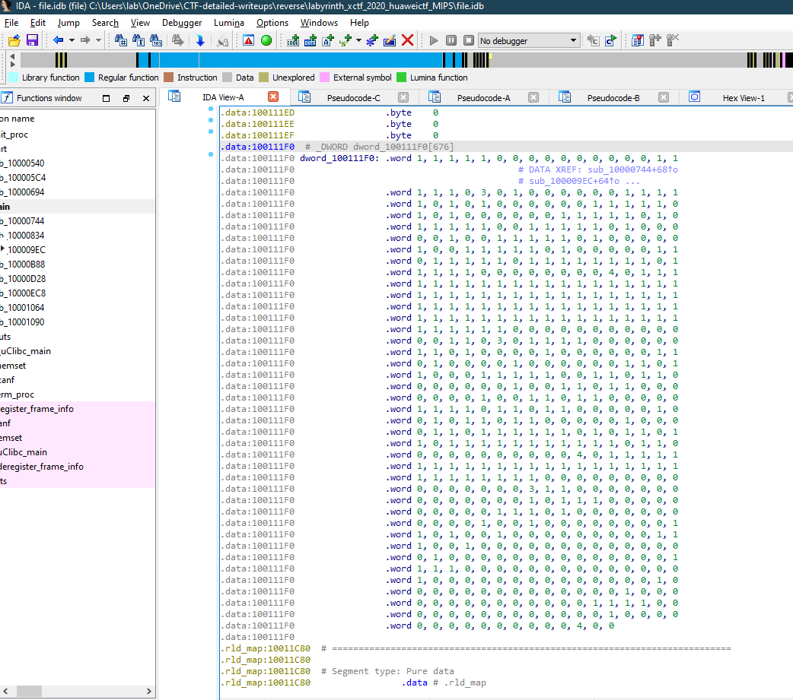

# xctf-2020-huaweictf-MIPS

> reverse MIPS
>
> files: `file`
>
> No description
>
> original writeup: https://www.xctf.org.cn/library/details/55599c9c17ea0e8ca0b094adbe075a03a7321599/
>
> IDA analysis file `.idb` provided. 
>
> Score estimation: below 200 points.
>
> Solution video (中文): *TBD*

- 此题是一道使用MIPS语言编写的迷宫问题，用了三张迷宫，IDA中逆向后伪代码有`puts((int)"success! the flag is flag{md5(your input)}");`


# Preliminary Analysis

使用IDA(32bit)打开所给文件，注意IDA需要支持MIPS decompile，可以在Help => About => Addons...查看支持的语言

main函数F5之后如下：在`sub_10001064`中，会将一个变量初始化为0，后续函数中可以看出这个变量是用于记录读取哪一个迷宫的，而`sub_10000834`函数则为迷宫操作的主函数。

```cpp
int __cdecl main(int argc, const char **argv, const char **envp)
{
  int v4; // [sp+0h] [+0h]

  sub_10001064();
  do
    v4 = sub_10000834();
  while ( v4 != 1LL && v4 != -1LL );
  return 0;
}
```

`sub_10000834`函数片段：可以看到多个类似的代码片段，经过各个方向的handler的具体分析可知：w上，a左，s下，d右

```cpp
if ( v0 == 'd' )
      {
        v2 = sub_10000D28();                    // 向右走
      }
```

而迷宫有多个，是可以根据各个方向的handler的具体操作看出来的，比如以go right handler (d handler)为例：

```cpp
__int64 sub_10000D28()
{
  if ( y != 14LL )
  {
    if ( dword_100111F0[225 * dword_10011D10 + 1 + 15 * x + y] == 1LL )// 如果向右走是1，则向右走的变成3，原本的位置变成1.
    {
      dword_100111F0[225 * dword_10011D10 + 1 + 15 * x + y] = 3;
      dword_100111F0[225 * dword_10011D10 + 15 * x + y] = 1;
    }
    else if ( dword_100111F0[225 * dword_10011D10 + 1 + 15 * x + y] == 4LL )// 如果向右走的为4，那么返回1，表示走出迷宫
    {
      return 1LL;
    }
  }
  return 0LL;                                   // 只要没有走到迷宫出口，就返回0
}
```

可以看到在迷宫矩阵dword_100111F0的index表达式中，有`225 * dword_10011D10`，而迷宫大小为`15*15`，故可以推测这里是在取不同的迷宫。

# Labyrinth Extraction

双击`dword_100111F0`可以到对应的定义位置



- `676 = 15*15*3 + 1`，数组大小吻合
- 将光标点到该变量处，`shift + E`(Edit => Export data),  Export as initialized C variable
- 提取出来的数组是一个一维数组，需要转换为三维数组来观察

## Labyrinth 1D to 3D

- 可以用如下代码将一维数组转换为三维的，仅需稍加修改

```cpp
void preprocessing() {  // transfer the original labyrinth to a readable form
    for (int i = 0; i < 675; ++i) {
        if (i % 225 == 0) {
            cout << "{";
        }
        if (i % 15 == 0) {
            cout << "\n{" << labyrinth_ori[i];
        } else {
            cout << ", " << labyrinth_ori[i];
        }
        if ((i + 1) % 15 == 0) {
            cout << "},";
        }
        if ((i + 1) % 225 == 0) {
            cout << "},\n";
        }
    }
}
```

- 经过了修改后，三维数组如下，可以直接写出各个迷宫的解密路线

```cpp
int labyrinth[3][15][15] = {{
                                {1, 1, 1, 1, 1, 0, 0, 0, 0, 0, 0, 0, 0, 0, 0},  // map 0 line 0: x=0
                                {1, 1, 1, 1, 1, 0, 3, 0, 1, 0, 0, 0, 0, 0, 0},  // s
                                {1, 1, 1, 1, 1, 0, 1, 0, 1, 0, 0, 0, 0, 0, 0},  // s
                                {1, 1, 1, 1, 1, 0, 1, 0, 1, 0, 0, 0, 0, 0, 0},  // s
                                {1, 1, 1, 1, 1, 0, 1, 0, 1, 1, 1, 1, 1, 0, 0},  // s
                                {1, 1, 1, 1, 1, 0, 1, 0, 0, 0, 0, 0, 1, 0, 0},  // s
                                {1, 1, 1, 1, 1, 0, 1, 0, 0, 0, 0, 0, 1, 0, 0},  // s
                                {1, 1, 1, 1, 1, 0, 1, 0, 0, 0, 0, 0, 1, 1, 0},  // s
                                {1, 1, 1, 1, 1, 0, 1, 1, 1, 1, 1, 1, 1, 1, 0},  // ddddddds
                                {1, 1, 1, 1, 1, 0, 0, 0, 0, 0, 0, 0, 0, 4, 0},  // arrive at 4
                                {1, 1, 1, 1, 1, 1, 1, 1, 1, 1, 1, 1, 1, 1, 1},  //
                                {1, 1, 1, 1, 1, 1, 1, 1, 1, 1, 1, 1, 1, 1, 1},  //
                                {1, 1, 1, 1, 1, 1, 1, 1, 1, 1, 1, 1, 1, 1, 1},  //
                                {1, 1, 1, 1, 1, 1, 1, 1, 1, 1, 1, 1, 1, 1, 1},  //
                                {1, 1, 1, 1, 1, 1, 1, 1, 1, 1, 1, 1, 1, 1, 1},  //
                            },                                                  // sssssssddddddds
                            {
                                {1, 1, 0, 0, 0, 0, 0, 0, 0, 0, 0, 0, 0, 0, 0},  // map 1 line 0: x=0
                                {1, 1, 0, 3, 0, 1, 1, 1, 1, 0, 0, 0, 0, 0, 0},  // s
                                {1, 1, 0, 1, 0, 0, 0, 0, 1, 0, 0, 0, 0, 0, 0},  // s
                                {1, 1, 0, 1, 0, 0, 0, 0, 1, 0, 0, 0, 0, 0, 0},  // s
                                {1, 1, 0, 1, 1, 0, 0, 0, 1, 1, 1, 1, 1, 0, 0},  // s
                                {1, 1, 0, 1, 1, 0, 0, 0, 0, 0, 0, 0, 1, 0, 0},  // s
                                {1, 1, 0, 1, 1, 0, 0, 0, 0, 0, 0, 0, 1, 0, 0},  // s
                                {1, 1, 0, 1, 1, 0, 0, 0, 0, 0, 1, 1, 1, 1, 0},  // s
                                {1, 1, 0, 1, 1, 0, 0, 0, 0, 0, 1, 0, 0, 1, 0},  // s
                                {1, 1, 0, 1, 1, 0, 0, 0, 0, 0, 1, 0, 0, 0, 0},  // s
                                {1, 1, 0, 1, 1, 1, 1, 1, 1, 0, 1, 0, 1, 1, 0},  // s
                                {1, 1, 0, 1, 1, 1, 1, 1, 1, 1, 1, 1, 1, 1, 0},  // dddddddddds
                                {1, 1, 0, 0, 0, 0, 0, 0, 0, 0, 0, 0, 0, 4, 0},  // arrive at 4
                                {1, 1, 1, 1, 1, 1, 1, 1, 1, 1, 1, 1, 1, 1, 1},  //
                                {1, 1, 1, 1, 1, 1, 1, 1, 1, 1, 1, 1, 1, 1, 1},  //
                            },  // ssssssssssdddddddddds
                            {
                                {0, 0, 0, 0, 0, 0, 0, 0, 0, 0, 0, 0, 0, 0, 0},  // map 2 line 0: x=0
                                {0, 3, 1, 1, 0, 0, 0, 0, 0, 0, 0, 0, 0, 0, 0},  // dds
                                {0, 0, 0, 1, 0, 1, 1, 1, 0, 0, 0, 0, 0, 0, 0},  // s   // dds
                                {0, 0, 0, 1, 1, 1, 0, 1, 0, 0, 0, 0, 0, 0, 0},  // ddw // s
                                {0, 0, 0, 0, 1, 0, 0, 1, 0, 0, 0, 0, 0, 0, 0},  // s
                                {0, 1, 1, 0, 1, 0, 0, 1, 0, 0, 0, 0, 0, 0, 0},  // s
                                {0, 0, 1, 1, 1, 0, 0, 1, 0, 0, 0, 0, 0, 0, 0},  // s
                                {0, 0, 0, 0, 0, 0, 0, 1, 0, 0, 0, 0, 0, 0, 0},  // s
                                {0, 0, 0, 0, 0, 0, 0, 1, 1, 1, 1, 0, 0, 0, 0},  // ddds
                                {0, 0, 0, 0, 0, 0, 0, 0, 0, 0, 1, 0, 0, 0, 0},  // s
                                {0, 0, 0, 0, 0, 0, 0, 0, 0, 0, 1, 0, 0, 0, 0},  // s
                                {0, 0, 0, 0, 0, 0, 0, 0, 0, 0, 1, 0, 0, 0, 0},  // s
                                {0, 0, 0, 0, 0, 0, 0, 0, 0, 0, 1, 1, 1, 1, 0},  // ddds
                                {0, 0, 0, 0, 0, 0, 0, 0, 0, 0, 0, 0, 0, 1, 0},  // s
                                {0, 0, 0, 0, 0, 0, 0, 0, 0, 0, 0, 0, 0, 4, 0},
                            }};  // ddssddwddssssssdddssssdddss
// sssssssdddddddsssssssssssddddddddddsddssddwddssssssdddssssdddss    // enter a ESC here
```


# Exploit

- 代码原本可以写的更简洁，但是这里写的尽量与IDA反编译后的结果对应，以便对照
- 需要注意的是，看到`the flag is flag{md5(your input)`并且还原出三个迷宫图之后，就可以计算出flag了，这里的cpp代码仅供对照逆向后伪代码，如无需对照，可以直接跳到flag章

```cpp
#include <cstring>
#include <iostream>

using namespace std;

int labyrinth_ori[676] = {
    1, 1, 1, 1, 1, 0, 0, 0, 0, 0, 0, 0, 0, 0, 0, 1, 1, 1, 1, 1, 0, 3, 0, 1, 0, 0, 0, 0, 0, 0, 1,
    1, 1, 1, 1, 0, 1, 0, 1, 0, 0, 0, 0, 0, 0, 1, 1, 1, 1, 1, 0, 1, 0, 1, 0, 0, 0, 0, 0, 0, 1, 1,
    1, 1, 1, 0, 1, 0, 1, 1, 1, 1, 1, 0, 0, 1, 1, 1, 1, 1, 0, 1, 0, 0, 0, 0, 0, 1, 0, 0, 1, 1, 1,
    1, 1, 0, 1, 0, 0, 0, 0, 0, 1, 0, 0, 1, 1, 1, 1, 1, 0, 1, 0, 0, 0, 0, 0, 1, 1, 0, 1, 1, 1, 1,
    1, 0, 1, 1, 1, 1, 1, 1, 1, 1, 0, 1, 1, 1, 1, 1, 0, 0, 0, 0, 0, 0, 0, 0, 4, 0, 1, 1, 1, 1, 1,
    1, 1, 1, 1, 1, 1, 1, 1, 1, 1, 1, 1, 1, 1, 1, 1, 1, 1, 1, 1, 1, 1, 1, 1, 1, 1, 1, 1, 1, 1, 1,
    1, 1, 1, 1, 1, 1, 1, 1, 1, 1, 1, 1, 1, 1, 1, 1, 1, 1, 1, 1, 1, 1, 1, 1, 1, 1, 1, 1, 1, 1, 1,
    1, 1, 1, 1, 1, 1, 1, 1, 1, 1, 0, 0, 0, 0, 0, 0, 0, 0, 0, 0, 0, 0, 0, 1, 1, 0, 3, 0, 1, 1, 1,
    1, 0, 0, 0, 0, 0, 0, 1, 1, 0, 1, 0, 0, 0, 0, 1, 0, 0, 0, 0, 0, 0, 1, 1, 0, 1, 0, 0, 0, 0, 1,
    0, 0, 0, 0, 0, 0, 1, 1, 0, 1, 1, 0, 0, 0, 1, 1, 1, 1, 1, 0, 0, 1, 1, 0, 1, 1, 0, 0, 0, 0, 0,
    0, 0, 1, 0, 0, 1, 1, 0, 1, 1, 0, 0, 0, 0, 0, 0, 0, 1, 0, 0, 1, 1, 0, 1, 1, 0, 0, 0, 0, 0, 1,
    1, 1, 1, 0, 1, 1, 0, 1, 1, 0, 0, 0, 0, 0, 1, 0, 0, 1, 0, 1, 1, 0, 1, 1, 0, 0, 0, 0, 0, 1, 0,
    0, 0, 0, 1, 1, 0, 1, 1, 1, 1, 1, 1, 0, 1, 0, 1, 1, 0, 1, 1, 0, 1, 1, 1, 1, 1, 1, 1, 1, 1, 1,
    1, 0, 1, 1, 0, 0, 0, 0, 0, 0, 0, 0, 0, 0, 0, 4, 0, 1, 1, 1, 1, 1, 1, 1, 1, 1, 1, 1, 1, 1, 1,
    1, 1, 1, 1, 1, 1, 1, 1, 1, 1, 1, 1, 1, 1, 1, 1, 0, 0, 0, 0, 0, 0, 0, 0, 0, 0, 0, 0, 0, 0, 0,
    0, 3, 1, 1, 0, 0, 0, 0, 0, 0, 0, 0, 0, 0, 0, 0, 0, 0, 1, 0, 1, 1, 1, 0, 0, 0, 0, 0, 0, 0, 0,
    0, 0, 1, 1, 1, 0, 1, 0, 0, 0, 0, 0, 0, 0, 0, 0, 0, 0, 1, 0, 0, 1, 0, 0, 0, 0, 0, 0, 0, 0, 1,
    1, 0, 1, 0, 0, 1, 0, 0, 0, 0, 0, 0, 0, 0, 0, 1, 1, 1, 0, 0, 1, 0, 0, 0, 0, 0, 0, 0, 0, 0, 0,
    0, 0, 0, 0, 1, 0, 0, 0, 0, 0, 0, 0, 0, 0, 0, 0, 0, 0, 0, 1, 1, 1, 1, 0, 0, 0, 0, 0, 0, 0, 0,
    0, 0, 0, 0, 0, 0, 1, 0, 0, 0, 0, 0, 0, 0, 0, 0, 0, 0, 0, 0, 0, 1, 0, 0, 0, 0, 0, 0, 0, 0, 0,
    0, 0, 0, 0, 0, 1, 0, 0, 0, 0, 0, 0, 0, 0, 0, 0, 0, 0, 0, 0, 1, 1, 1, 1, 0, 0, 0, 0, 0, 0, 0,
    0, 0, 0, 0, 0, 0, 0, 1, 0, 0, 0, 0, 0, 0, 0, 0, 0, 0, 0, 0, 0, 0, 4, 0, 0};


int labyrinth[3][15][15] = {{
                                {1, 1, 1, 1, 1, 0, 0, 0, 0, 0, 0, 0, 0, 0, 0},  // map 0 line 0: x=0
                                {1, 1, 1, 1, 1, 0, 3, 0, 1, 0, 0, 0, 0, 0, 0},  // s
                                {1, 1, 1, 1, 1, 0, 1, 0, 1, 0, 0, 0, 0, 0, 0},  // s
                                {1, 1, 1, 1, 1, 0, 1, 0, 1, 0, 0, 0, 0, 0, 0},  // s
                                {1, 1, 1, 1, 1, 0, 1, 0, 1, 1, 1, 1, 1, 0, 0},  // s
                                {1, 1, 1, 1, 1, 0, 1, 0, 0, 0, 0, 0, 1, 0, 0},  // s
                                {1, 1, 1, 1, 1, 0, 1, 0, 0, 0, 0, 0, 1, 0, 0},  // s
                                {1, 1, 1, 1, 1, 0, 1, 0, 0, 0, 0, 0, 1, 1, 0},  // s
                                {1, 1, 1, 1, 1, 0, 1, 1, 1, 1, 1, 1, 1, 1, 0},  // ddddddds
                                {1, 1, 1, 1, 1, 0, 0, 0, 0, 0, 0, 0, 0, 4, 0},  // arrive at 4
                                {1, 1, 1, 1, 1, 1, 1, 1, 1, 1, 1, 1, 1, 1, 1},  //
                                {1, 1, 1, 1, 1, 1, 1, 1, 1, 1, 1, 1, 1, 1, 1},  //
                                {1, 1, 1, 1, 1, 1, 1, 1, 1, 1, 1, 1, 1, 1, 1},  //
                                {1, 1, 1, 1, 1, 1, 1, 1, 1, 1, 1, 1, 1, 1, 1},  //
                                {1, 1, 1, 1, 1, 1, 1, 1, 1, 1, 1, 1, 1, 1, 1},  //
                            },                                                  // sssssssddddddds
                            {
                                {1, 1, 0, 0, 0, 0, 0, 0, 0, 0, 0, 0, 0, 0, 0},  // map 1 line 0: x=0
                                {1, 1, 0, 3, 0, 1, 1, 1, 1, 0, 0, 0, 0, 0, 0},  // s
                                {1, 1, 0, 1, 0, 0, 0, 0, 1, 0, 0, 0, 0, 0, 0},  // s
                                {1, 1, 0, 1, 0, 0, 0, 0, 1, 0, 0, 0, 0, 0, 0},  // s
                                {1, 1, 0, 1, 1, 0, 0, 0, 1, 1, 1, 1, 1, 0, 0},  // s
                                {1, 1, 0, 1, 1, 0, 0, 0, 0, 0, 0, 0, 1, 0, 0},  // s
                                {1, 1, 0, 1, 1, 0, 0, 0, 0, 0, 0, 0, 1, 0, 0},  // s
                                {1, 1, 0, 1, 1, 0, 0, 0, 0, 0, 1, 1, 1, 1, 0},  // s
                                {1, 1, 0, 1, 1, 0, 0, 0, 0, 0, 1, 0, 0, 1, 0},  // s
                                {1, 1, 0, 1, 1, 0, 0, 0, 0, 0, 1, 0, 0, 0, 0},  // s
                                {1, 1, 0, 1, 1, 1, 1, 1, 1, 0, 1, 0, 1, 1, 0},  // s
                                {1, 1, 0, 1, 1, 1, 1, 1, 1, 1, 1, 1, 1, 1, 0},  // dddddddddds
                                {1, 1, 0, 0, 0, 0, 0, 0, 0, 0, 0, 0, 0, 4, 0},  // arrive at 4
                                {1, 1, 1, 1, 1, 1, 1, 1, 1, 1, 1, 1, 1, 1, 1},  //
                                {1, 1, 1, 1, 1, 1, 1, 1, 1, 1, 1, 1, 1, 1, 1},  //
                            },  // ssssssssssdddddddddds
                            {
                                {0, 0, 0, 0, 0, 0, 0, 0, 0, 0, 0, 0, 0, 0, 0},  // map 2 line 0: x=0
                                {0, 3, 1, 1, 0, 0, 0, 0, 0, 0, 0, 0, 0, 0, 0},  // dds
                                {0, 0, 0, 1, 0, 1, 1, 1, 0, 0, 0, 0, 0, 0, 0},  // s   // dds
                                {0, 0, 0, 1, 1, 1, 0, 1, 0, 0, 0, 0, 0, 0, 0},  // ddw // s
                                {0, 0, 0, 0, 1, 0, 0, 1, 0, 0, 0, 0, 0, 0, 0},  // s
                                {0, 1, 1, 0, 1, 0, 0, 1, 0, 0, 0, 0, 0, 0, 0},  // s
                                {0, 0, 1, 1, 1, 0, 0, 1, 0, 0, 0, 0, 0, 0, 0},  // s
                                {0, 0, 0, 0, 0, 0, 0, 1, 0, 0, 0, 0, 0, 0, 0},  // s
                                {0, 0, 0, 0, 0, 0, 0, 1, 1, 1, 1, 0, 0, 0, 0},  // ddds
                                {0, 0, 0, 0, 0, 0, 0, 0, 0, 0, 1, 0, 0, 0, 0},  // s
                                {0, 0, 0, 0, 0, 0, 0, 0, 0, 0, 1, 0, 0, 0, 0},  // s
                                {0, 0, 0, 0, 0, 0, 0, 0, 0, 0, 1, 0, 0, 0, 0},  // s
                                {0, 0, 0, 0, 0, 0, 0, 0, 0, 0, 1, 1, 1, 1, 0},  // ddds
                                {0, 0, 0, 0, 0, 0, 0, 0, 0, 0, 0, 0, 0, 1, 0},  // s
                                {0, 0, 0, 0, 0, 0, 0, 0, 0, 0, 0, 0, 0, 4, 0},
                            }};  // ddssddwddssssssdddssssdddss
// sssssssdddddddsssssssssssddddddddddsddssddwddssssssdddssssdddss    // enter a ESC here
void preprocessing() {  // transfer the original labyrinth to a readable form
    for (int i = 0; i < 675; ++i) {
        if (i % 225 == 0) {
            cout << "{";
        }
        if (i % 15 == 0) {
            cout << "\n{" << labyrinth_ori[i];
        } else {
            cout << ", " << labyrinth_ori[i];
        }
        if ((i + 1) % 15 == 0) {
            cout << "},";
        }
        if ((i + 1) % 225 == 0) {
            cout << "},\n";
        }
    }
}

int labyrinth_idx;
int x, y;
void ini() {
    labyrinth_idx = 0;  // corresponding to dword_10011D10
}
int ini_xy() {
    int i, j;
    bool result;
    for (i = 0;; ++i) {
        result = i < 15;
        if (i >= 15) {
            break;
        }
        for (j = 0; j < 15; ++j) {
            if (labyrinth_ori[225 * labyrinth_idx + 15 * i + j] == 3) {
                x = i;
                y = j;
                break;
            }
            return result;
        }
    }
    return result;
}
int movRight() {
    if (y != 14) {
        if (labyrinth_ori[225 * labyrinth_idx + 1 + 15 * x + y] == 1) {
            labyrinth_ori[225 * labyrinth_idx + 1 + 15 * x + y] = 3;
            labyrinth_ori[225 * labyrinth_idx + 15 * x + y] = 1;
        } else if (labyrinth_ori[225 * labyrinth_idx + 1 + 15 * x + y] == 4) {
            return 1;
        }
    }
    return 0;
}
int movDown() {
    if (x != 14) {
        if (labyrinth_ori[225 * labyrinth_idx + 15 + 15 * x + y] == 1) {
            labyrinth_ori[225 * labyrinth_idx + 15 + 15 * x + y] = 3;
            labyrinth_ori[225 * labyrinth_idx + 15 * x + y] = 1;
        } else if (labyrinth_ori[225 * labyrinth_idx + 15 + 15 * x + y] == 4) {
            return 1;
        }
    }
    return 0;
}
int movUp() {
    if (x) {
        if (labyrinth_ori[225 * labyrinth_idx - 15 + 15 * x + y] == 1) {
            labyrinth_ori[225 * labyrinth_idx - 15 + 15 * x + y] = 3;
            labyrinth_ori[225 * labyrinth_idx + 15 * x + y] = 1;
        } else if (labyrinth_ori[225 * labyrinth_idx - 15 + 15 * x + y] == 4) {
            return 1;
        }
    }
    return 0;
}
int movLeft() {
    if (y) {
        if (labyrinth_ori[225 * labyrinth_idx - 1 + 15 * x + y] == 1) {
            labyrinth_ori[225 * labyrinth_idx - 1 + 15 * x + y] = 3;
            labyrinth_ori[225 * labyrinth_idx + 15 * x + y] = 1;
        } else if (labyrinth_ori[225 * labyrinth_idx - 1 + 15 * x + y] == 4) {
            return 1;
        }
    }
    return 0; 
}
int labyrinth_main() {
    char action;  // action extracted from v4 // corresponding to v0
    int v2;       // record move action return value
    int v3 = 0;   // v4's index
    char v4[512];
    memset(v4, 0, 512);
    scanf("%s", v4);
    while (1) {
        do {
            v2 = 0;
            // here call a function: if 4(exit) found in a map, record x,y and return true
            // else return false
            ini_xy();  // ini x, y
            action = v4[v3];
            cout << "[DEBUG] action=" << (int)action << " v3=" << v3 << endl;
            if (action == 'd') {  // move right
                v2 = movRight();
            } else if (action == 's') {  // move down
                v2 = movDown();
            } else if (action == 'w') {  // move up
                v2 = movUp();
            } else if (action == 'a') {
                v2 = movLeft();
            } else if (action == '\x1B') {  // ESC
                return -1;
            } else {
                cout << "[WARNING] To avoid Segmentation fault (core dumped) ERROR, break" << endl;
                break;
            }
            ++v3;
        } while (v2 != 1);
        if (labyrinth_idx == 2) {
            break;
        }
        cout << "[DEBUG] labyrinth_idx=" << labyrinth_idx << endl;
        ++labyrinth_idx;
    }
    cout << "success! the flag is flag{md5(your input)}" << endl;
    return 1;
}
int main() {
    int ret_value;
    void ini();
    do {
        ret_value = labyrinth_main();
    } while (ret_value != 1 && ret_value != -1);
    return 0;
}
```


# flag

```python
import hashlib
m = hashlib.md5()
m.update(b'sssssssdddddddsssssssssssddddddddddsddssddwddssssssdddssssdddss')
print(m.hexdigest())
```

- flag: `999ea6aa6c365ab43eec2a0f0e5968d5`

