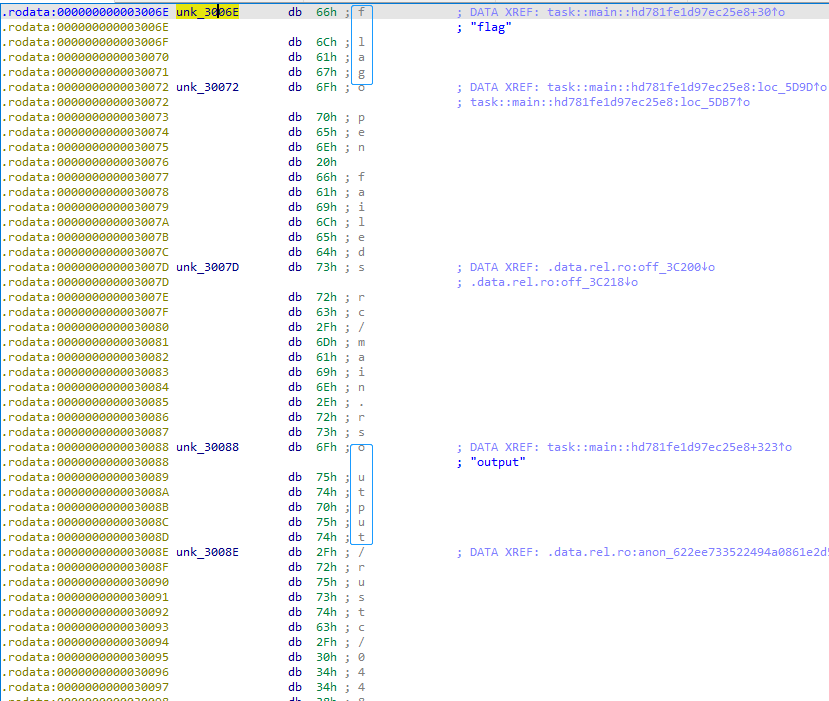
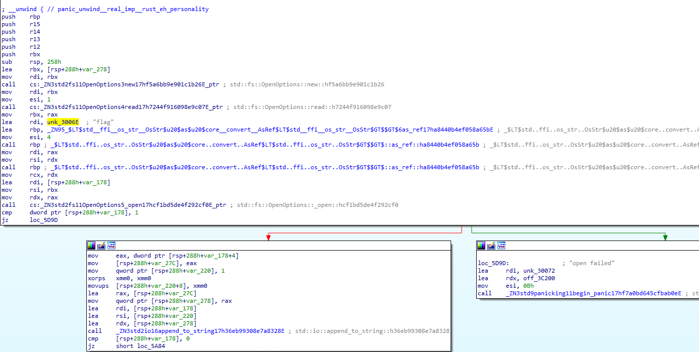
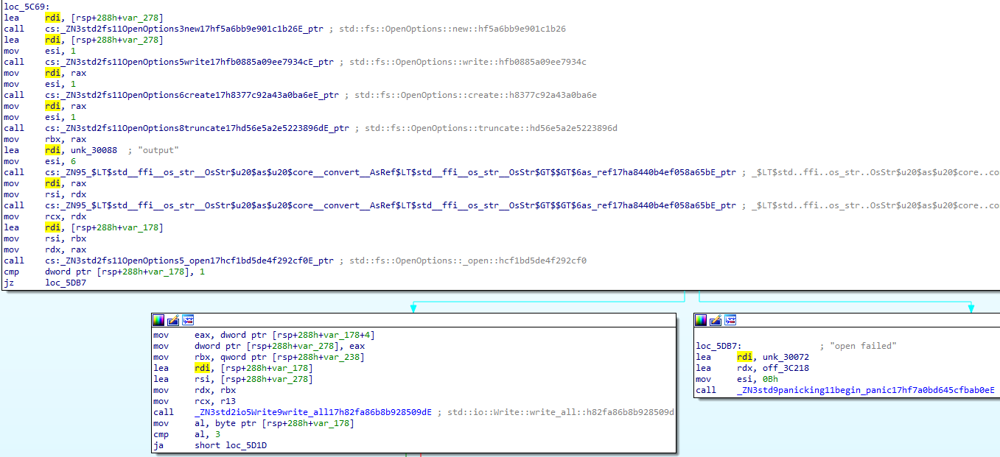
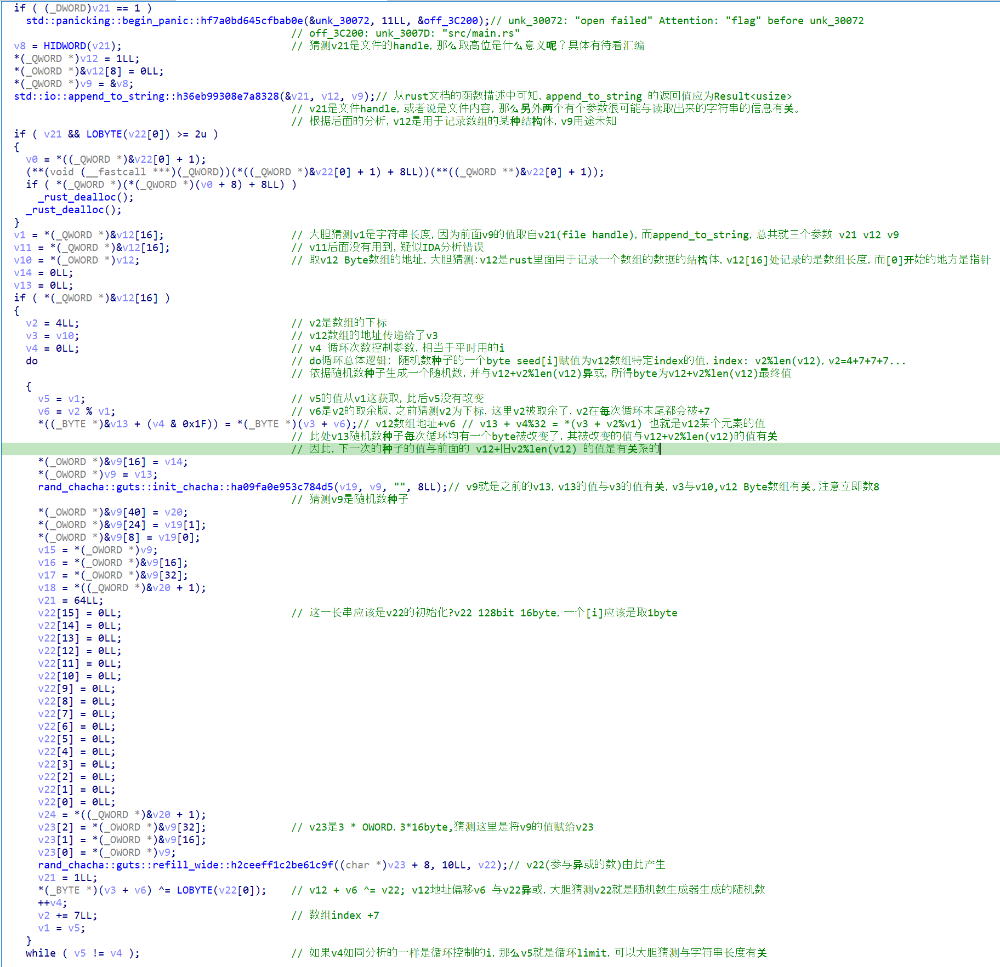

# rust starctf 2021 stream

> 2021 starctf   https://github.com/sixstars/starctf2021
>
> re: stream
>
> file: `task`, `output` (46 Bytes).    note: `output_ori` is the original `output` file, used by python script.
>
> original writeup: https://github.com/sixstars/starctf2021/tree/main/re-stream
>
> refer writeup: http://www.bxnop.cn/2021/01/17/starctf2021/

- rust code


> some rust related writeup:
>
> https://blog.fullstackpentest.com/a-rust-reverse-writeup.html       detailed

# Rust Installation

- rust installation in Linux: (test in Kali 2020.4)

1. [opt] mirrors: 

   1. `export RUSTUP_DIST_SERVER=https://mirrors.ustc.edu.cn/rust-static`
   2. `export RUSTUP_UPDATE_ROOT=https://mirrors.ustc.edu.cn/rust-static/rustup`

2. rust install: `curl https://sh.rustup.rs -sSf | sh`

3. make `rustup` take effect: `source $HOME/.cargo/env`

4. test: `rustc -V` or `ustup -v`

5. [opt] package manage: `vi $HOME/.cargo/config`, then change the content to:

   ```json
   [source.crates-io]
   registry = "https://github.com/rust-lang/crates.io-index"
   replace-with = 'ustc'
   [source.ustc]
   registry = "git://mirrors.ustc.edu.cn/crates.io-index"
   ```
   
6. update rustup: `rustup self update`;  install **RLS**(Rust Language Server): `rustup component add rls rust-analysis rust-src`

7. [opt] install gcc toolchain: `sudo apt-get install build-essential`

8. test: `rustc --version`


# Try to Run

```python
$ ./a
thread 'main' panicked at 'open failed', src/main.rs:10:19
note: run with `RUST_BACKTRACE=1` environment variable to display a backtrace

$ export RUST_BACKTRACE=1
$ ./a
thread 'main' panicked at 'open failed', src/main.rs:10:19
stack backtrace:
   0: backtrace::backtrace::libunwind::trace
             at /cargo/registry/src/github.com-1ecc6299db9ec823/backtrace-0.3.46/src/backtrace/libunwind.                                                                       rs:86
   1: backtrace::backtrace::trace_unsynchronized
             at /cargo/registry/src/github.com-1ecc6299db9ec823/backtrace-0.3.46/src/backtrace/mod.rs:66
   2: std::sys_common::backtrace::_print_fmt
             at src/libstd/sys_common/backtrace.rs:78
   3: <std::sys_common::backtrace::_print::DisplayBacktrace as core::fmt::Display>::fmt
             at src/libstd/sys_common/backtrace.rs:59
   4: core::fmt::write
             at src/libcore/fmt/mod.rs:1076
   5: std::io::Write::write_fmt
             at src/libstd/io/mod.rs:1537
   6: std::sys_common::backtrace::_print
             at src/libstd/sys_common/backtrace.rs:62
   7: std::sys_common::backtrace::print
             at src/libstd/sys_common/backtrace.rs:49
   8: std::panicking::default_hook::{{closure}}
             at src/libstd/panicking.rs:198
   9: std::panicking::default_hook
             at src/libstd/panicking.rs:217
  10: std::panicking::rust_panic_with_hook
             at src/libstd/panicking.rs:526
  11: std::panicking::begin_panic
  12: task::main
  13: std::rt::lang_start::{{closure}}
  14: std::rt::lang_start_internal::{{closure}}
             at src/libstd/rt.rs:52
  15: std::panicking::try::do_call
             at src/libstd/panicking.rs:348
  16: std::panicking::try
             at src/libstd/panicking.rs:325
  17: std::panic::catch_unwind
             at src/libstd/panic.rs:394
  18: std::rt::lang_start_internal
             at src/libstd/rt.rs:51
  19: main
  20: __libc_start_main
  21: _start
note: Some details are omitted, run with `RUST_BACKTRACE=full` for a verbose backtrace.
```

- cant run correctly, guess something wrong related to file open.


# IDA Analysis

> https://www.anquanke.com/post/id/169970   main entry point in rust

- 需要注意的是，IDA解析完之后，如果在main函数处直接按F5之后，伪代码很短，核心是一个跳转，而这个跳转到的函数并不是函数的主要过程
- 找到真正的主要过程的最简单方法就是写个简单的rust hello world程序，用IDA分析，对比
- main assembly of `task`:

```assembly
main proc near

var_8= qword ptr -8

; __unwind {
push    rax
mov     rcx, rsi
movsxd  rdx, edi
lea     rax, _ZN4task4main17hd781fe1d97ec25e8E ; task::main::hd781fe1d97ec25e8 ; 这里才是main process
mov     [rsp+8+var_8], rax
lea     rsi, anon_7800731c0ac5766f139ae015a1483067_0_llvm_5552154296325893510
mov     rdi, rsp
call    cs:_ZN3std2rt19lang_start_internal17h72cc068ed2d0ac53E_ptr ; std::rt::lang_start_internal::h72cc068ed2d0ac53 ;直接F5会变成跳转到这个地址
pop     rcx
retn
; } // starts at 5E90
main endp
```

- rust编译器通过使用寄存器指向主函数地址，作为函数指针，作为`lang_start_internal`函数的参数，供rust运行时来初始化程序状态


## Main Process

- the main process is function `task::main::hd781fe1d97ec25e8`
- file new and read at the beginning of main process:

```cpp
// snippet in task::main::hd781fe1d97ec25e8
  std::fs::OpenOptions::new::hf5a6bb9e901c1b26();
  std::fs::OpenOptions::read::h7244f916098e9c07();
  _$LT$std..ffi..os_str..OsStr$u20$as$u20$core..convert..AsRef$LT$std..ffi..os_str..OsStr$GT$$GT$::as_ref::ha8440b4ef058a65b();
  _$LT$std..ffi..os_str..OsStr$u20$as$u20$core..convert..AsRef$LT$std..ffi..os_str..OsStr$GT$$GT$::as_ref::ha8440b4ef058a65b();
  std::fs::OpenOptions::_open::hcf1bd5de4f292cf0();
  if ( (_DWORD)v21 == 1 )
    std::panicking::begin_panic::hf7a0bd645cfbab0e(&unk_30072, 11LL, &off_3C200);
```

- `unk_30072`: `open failed`  (size=11)
- `off_3C200` point to `unk_3007D`: `src/main.rs` (size=11)
- **Attention**: string `flag` found before `unk_30072`


- another file operation: write:

```cpp
// snippet in task::main::hd781fe1d97ec25e8
  std::fs::OpenOptions::new::hf5a6bb9e901c1b26();
  std::fs::OpenOptions::write::hfb0885a09ee7934c();
  std::fs::OpenOptions::create::h8377c92a43a0ba6e();
  std::fs::OpenOptions::truncate::hd56e5a2e5223896d();
  _$LT$std..ffi..os_str..OsStr$u20$as$u20$core..convert..AsRef$LT$std..ffi..os_str..OsStr$GT$$GT$::as_ref::ha8440b4ef058a65b();
  _$LT$std..ffi..os_str..OsStr$u20$as$u20$core..convert..AsRef$LT$std..ffi..os_str..OsStr$GT$$GT$::as_ref::ha8440b4ef058a65b();
  std::fs::OpenOptions::_open::hcf1bd5de4f292cf0();
  if ( (_DWORD)v21 == 1 )
    std::panicking::begin_panic::hf7a0bd645cfbab0e(&unk_30072, 11LL, &off_3C218);
  *(_DWORD *)v9 = HIDWORD(v21);
  std::io::Write::write_all::h82fa86b8b928509d(&v21, v9, v10, v1);
```

- `unk_30072`: `open failed`  (size=11)
- `off_3C218` point to `unk_3007D`: `src/main.rs` (size=11) .  Same as before




## to boldly hypothesize, and to carefully validate

> 大胆假设小心求证

- 大胆猜测有个文件`flag`被读取，下面详述猜测原因与求证过程

### boldly hypothesize

- 从这rodata片段来看，`open failed`和`src/main.rs`都被重用来用作两次文件操作的报错信息了，`src/main.rs`很可能只是当时的编译器生成的字符串，毕竟在做题时以及运行程序时，并没有`src`文件夹，而报错中仍有`src`字样。
- 而`output`字符串在这附近出现了，且题目给出的文件中正好就有一个46 Bytes的`output`文件，那么就在这附近的字符串`flag`很可能就是另一个文件的文件名。

### carefully validate

- 首先，该文件用rust写的已经很明确了，那么IDA注定无法准确逆向该代码，所以一切的分析都要往底层迈进。(指汇编)
- 小心求证主要步骤：
- 1. 标注关键字符串的位置
  2. 找到关键字符串被使用的地方
  3. 分析关键字符串附近的代码功能，注意交叉分析

在标记好几个关键字符串之后，在IDA-View窗口中查看使用到了`flag`, `output`的汇编代码，其附近的汇编代码如下：

- assembly where "flag" used:



- assembly where "output" used:



- brief summary: `flag`, `output`前面的函数调用都是类似new read write create一类的，后面会有一行指令修改寄存器`esi`的值，而值正好就是字符串长度。然后调用若干函数之后，都有一个分支，可能跳转到使用"open failed"的地方。两段代码相似度很高，可以通过提供的`i64`文件在IDA中进一步分析，可以发现更多相似之处。故`flag`是文件名实锤，且根据`flag`前的调用，这个文件仅被读取。


## Encrypt Process

- More details are in `.i64` file, includes assembly comments.



- 再次强调，IDA并没有对rust的逆向做支持，所以这里逆向出来的伪C代码可能存在更多在注释中没有写明的错误
- 代码总体逻辑：随机数种子`seed` (32byte)一开始被初始化为0，然后每次循环都有一个byte被改变，该byte改变后的值为`v12[index]`, v12就是从`flag`文件中读出来的byte数组，`index = (4+7+7+7...) % len(v12)`，即第一轮为4，第二轮为11，.....。依据`seed`，生成一个`randNum`，`v12[index] ^= randNum`，一直循环直至循环次数等于len(v12)

放上官方给出的rust源码作为对照

> https://github.com/sixstars/starctf2021/blob/main/re-stream/main.rs

```rust
use std::fs::File;
use std::io::prelude::*;
use std::path::Path;
use rand::{Rng, SeedableRng, rngs::StdRng};

fn main() {
    let path = Path::new("flag");

    let mut file = match File::open(&path) {
        Err(_) => panic!("open failed"),
        Ok(file) => file,
    };

    let mut s = String::new();
    file.read_to_string(&mut s);

    let mut bs = s.into_bytes(); 
    //let key = bs.clone();
    let mut seed : [u8; 32] = [0; 32];
    for i in 0..bs.len() {
        let idx = (7*i+4)%bs.len();
        seed[i%32] = bs[idx];
        let mut rng = StdRng::from_seed(seed);
        let r: u8 = rng.gen();
        bs[idx] ^= r;
    }

    let path = Path::new("output");

    let mut file = match File::create(&path) {
        Err(_) => panic!("open failed"),
        Ok(file) => file,
    };
    file.write_all(bs.as_slice());
}
```


# Flag Brute Force Cracking

- 既然文件已经可以运行了，seed的生成方式也了解了，那么可以通过多次运行rust程序，暴力还原出原本的`flag`文件
- 暴力破解思路：
  1. `i=4`
  2. 令`flag[i]`的值遍历字符集，运行rust，看出来的`output[i]`和原本的`output[i]`是否一样，一样的话这个值就是`flag[i]`的值
  3. `i = (i+4) % len(output)`, 依据题目给的`output`文件，长度为46byte

```python
# modified from https://github.com/sixstars/starctf2021/blob/main/re-stream/solve.py
import os
import string

tab = string.printable
tab = "ABCDEFGHIJKLMNOPQRSTUVWXYZabcdefghijklmnopqrstuvwxyz0123456789+/{}_=-~!.@#%^&*()"
# '0123456789abcdefghijklmnopqrstuvwxyzABCDEFGHIJKLMNOPQRSTUVWXYZ{}*'
sz = 46
arr = [0]*sz

with open('./output_ori','rb') as f:
    ct = f.read()

def se(i):
    global arr
    print(i, arr, ''.join(map(chr,arr)))
    if(i >= sz):
        print(''.join(map(chr,arr))) # finished
        exit()
    for ch in tab: # traversal all printable char
        idx = (7*i + 4) % sz # specific order
        arr[idx] = ord(ch)
        candidate = ''.join(map(chr, arr)) # a int array to a chr array
        with open('flag','wb') as f: # write to file: flag
            f.write(candidate.encode()) # encode: str to byte
        os.system("./task") # execute rust execution: task
        with open('output','rb') as f:
            outp = f.read() # read file: output
        if ct[idx] == outp[idx]:
            se(i+1)
        
#arr[:5] = [42, 99, 116, 102, 123]
se(0)
```

> 可能需要执行指令`chmod 777 ./task`

- necessary files at root directory of python script:`task`, `output_ori`
- flag: `*ctf{EbXZCOD56vEHNSofFvRHG7XtgFJXcUXUGnaaaaaa}`

## Script Output

```c
(base) ┌──(kali㉿kali)-[~/CTF/rust]
└─$ python solve.py
0 [0, 0, 0, 0, 0, 0, 0, 0, 0, 0, 0, 0, 0, 0, 0, 0, 0, 0, 0, 0, 0, 0, 0, 0, 0, 0, 0, 0, 0, 0, 0, 0, 0, 0, 0, 0, 0, 0, 0, 0, 0, 0, 0, 0, 0, 0]
1 [0, 0, 0, 0, 123, 0, 0, 0, 0, 0, 0, 0, 0, 0, 0, 0, 0, 0, 0, 0, 0, 0, 0, 0, 0, 0, 0, 0, 0, 0, 0, 0, 0, 0, 0, 0, 0, 0, 0, 0, 0, 0, 0, 0, 0, 0] {
2 [0, 0, 0, 0, 123, 0, 0, 0, 0, 0, 0, 68, 0, 0, 0, 0, 0, 0, 0, 0, 0, 0, 0, 0, 0, 0, 0, 0, 0, 0, 0, 0, 0, 0, 0, 0, 0, 0, 0, 0, 0, 0, 0, 0, 0, 0] {D
3 [0, 0, 0, 0, 123, 0, 0, 0, 0, 0, 0, 68, 0, 0, 0, 0, 0, 0, 83, 0, 0, 0, 0, 0, 0, 0, 0, 0, 0, 0, 0, 0, 0, 0, 0, 0, 0, 0, 0, 0, 0, 0, 0, 0, 0, 0] {DS
4 [0, 0, 0, 0, 123, 0, 0, 0, 0, 0, 0, 68, 0, 0, 0, 0, 0, 0, 83, 0, 0, 0, 0, 0, 0, 71, 0, 0, 0, 0, 0, 0, 0, 0, 0, 0, 0, 0, 0, 0, 0, 0, 0, 0, 0, 0] {DSG
5 [0, 0, 0, 0, 123, 0, 0, 0, 0, 0, 0, 68, 0, 0, 0, 0, 0, 0, 83, 0, 0, 0, 0, 0, 0, 71, 0, 0, 0, 0, 0, 0, 78, 0, 0, 0, 0, 0, 0, 0, 0, 0, 0, 0, 0, 0] {DSGN
5 [0, 0, 0, 0, 123, 0, 0, 0, 0, 0, 0, 68, 0, 0, 0, 0, 0, 0, 83, 0, 0, 0, 0, 0, 0, 71, 0, 0, 0, 0, 0, 0, 88, 0, 0, 0, 0, 0, 0, 41, 0, 0, 0, 0, 0, 0] {DSGX)
6 [0, 0, 0, 0, 123, 0, 0, 0, 0, 0, 0, 68, 0, 0, 0, 0, 0, 0, 83, 0, 0, 0, 0, 0, 0, 71, 0, 0, 0, 0, 0, 0, 88, 0, 0, 0, 0, 0, 0, 97, 0, 0, 0, 0, 0, 0] {DSGXa
7 [42, 0, 0, 0, 123, 0, 0, 0, 0, 0, 0, 68, 0, 0, 0, 0, 0, 0, 83, 0, 0, 0, 0, 0, 0, 71, 0, 0, 0, 0, 0, 0, 88, 0, 0, 0, 0, 0, 0, 97, 0, 0, 0, 0, 0, 0] *{DSGXa
8 [42, 0, 0, 0, 123, 0, 0, 88, 0, 0, 0, 68, 0, 0, 0, 0, 0, 0, 83, 0, 0, 0, 0, 0, 0, 71, 0, 0, 0, 0, 0, 0, 88, 0, 0, 0, 0, 0, 0, 97, 0, 0, 0, 0, 0, 0] *{XDSGXa
9 [42, 0, 0, 0, 123, 0, 0, 88, 0, 0, 0, 68, 0, 0, 118, 0, 0, 0, 83, 0, 0, 0, 0, 0, 0, 71, 0, 0, 0, 0, 0, 0, 88, 0, 0, 0, 0, 0, 0, 97, 0, 0, 0, 0, 0, 0] *{XDvSGXa
10 [42, 0, 0, 0, 123, 0, 0, 88, 0, 0, 0, 68, 0, 0, 118, 0, 0, 0, 83, 0, 0, 70, 0, 0, 0, 71, 0, 0, 0, 0, 0, 0, 88, 0, 0, 0, 0, 0, 0, 97, 0, 0, 0, 0, 0, 0] *{XDvSFGXa
11 [42, 0, 0, 0, 123, 0, 0, 88, 0, 0, 0, 68, 0, 0, 118, 0, 0, 0, 83, 0, 0, 70, 0, 0, 0, 71, 0, 0, 116, 0, 0, 0, 88, 0, 0, 0, 0, 0, 0, 97, 0, 0, 0, 0, 0, 0] *{XDvSFGtXa
12 [42, 0, 0, 0, 123, 0, 0, 88, 0, 0, 0, 68, 0, 0, 118, 0, 0, 0, 83, 0, 0, 70, 0, 0, 0, 71, 0, 0, 116, 0, 0, 0, 88, 0, 0, 88, 0, 0, 0, 97, 0, 0, 0, 0, 0, 0] *{XDvSFGtXXa
13 [42, 0, 0, 0, 123, 0, 0, 88, 0, 0, 0, 68, 0, 0, 118, 0, 0, 0, 83, 0, 0, 70, 0, 0, 0, 71, 0, 0, 116, 0, 0, 0, 88, 0, 0, 88, 0, 0, 0, 97, 0, 0, 97, 0, 0, 0] *{XDvSFGtXXaa
14 [42, 0, 0, 102, 123, 0, 0, 88, 0, 0, 0, 68, 0, 0, 118, 0, 0, 0, 83, 0, 0, 70, 0, 0, 0, 71, 0, 0, 116, 0, 0, 0, 88, 0, 0, 88, 0, 0, 0, 97, 0, 0, 97, 0, 0, 0] *f{XDvSFGtXXaa
15 [42, 0, 0, 102, 123, 0, 0, 88, 0, 0, 79, 68, 0, 0, 118, 0, 0, 0, 83, 0, 0, 70, 0, 0, 0, 71, 0, 0, 116, 0, 0, 0, 88, 0, 0, 88, 0, 0, 0, 97, 0, 0, 97, 0, 0, 0] *f{XODvSFGtXXaa
16 [42, 0, 0, 102, 123, 0, 0, 88, 0, 0, 79, 68, 0, 0, 118, 0, 0, 78, 83, 0, 0, 70, 0, 0, 0, 71, 0, 0, 116, 0, 0, 0, 88, 0, 0, 88, 0, 0, 0, 97, 0, 0, 97, 0, 0, 0] *f{XODvNSFGtXXaa
17 [42, 0, 0, 102, 123, 0, 0, 88, 0, 0, 79, 68, 0, 0, 118, 0, 0, 78, 83, 0, 0, 70, 0, 0, 72, 71, 0, 0, 116, 0, 0, 0, 88, 0, 0, 88, 0, 0, 0, 97, 0, 0, 97, 0, 0, 0] *f{XODvNSFHGtXXaa
18 [42, 0, 0, 102, 123, 0, 0, 88, 0, 0, 79, 68, 0, 0, 118, 0, 0, 78, 83, 0, 0, 70, 0, 0, 72, 71, 0, 0, 116, 0, 0, 74, 88, 0, 0, 88, 0, 0, 0, 97, 0, 0, 97, 0, 0, 0] *f{XODvNSFHGtJXXaa
19 [42, 0, 0, 102, 123, 0, 0, 88, 0, 0, 79, 68, 0, 0, 118, 0, 0, 78, 83, 0, 0, 70, 0, 0, 72, 71, 0, 0, 116, 0, 0, 74, 88, 0, 0, 88, 0, 0, 110, 97, 0, 0, 97, 0, 0, 0] *f{XODvNSFHGtJXXnaa
20 [42, 0, 0, 102, 123, 0, 0, 88, 0, 0, 79, 68, 0, 0, 118, 0, 0, 78, 83, 0, 0, 70, 0, 0, 72, 71, 0, 0, 116, 0, 0, 74, 88, 0, 0, 88, 0, 0, 110, 97, 0, 0, 97, 0, 0, 125] *f{XODvNSFHGtJXXnaa}
21 [42, 0, 0, 102, 123, 0, 98, 88, 0, 0, 79, 68, 0, 0, 118, 0, 0, 78, 83, 0, 0, 70, 0, 0, 72, 71, 0, 0, 116, 0, 0, 74, 88, 0, 0, 88, 0, 0, 110, 97, 0, 0, 97, 0, 0, 125] *f{bXODvNSFHGtJXXnaa}
22 [42, 0, 0, 102, 123, 0, 98, 88, 0, 0, 79, 68, 0, 99, 118, 0, 0, 78, 83, 0, 0, 70, 0, 0, 72, 71, 0, 0, 116, 0, 0, 74, 88, 0, 0, 88, 0, 0, 110, 97, 0, 0, 97, 0, 0, 125] *f{bXODcvNSFHGtJXXnaa}
22 [42, 0, 0, 102, 123, 0, 98, 88, 0, 0, 79, 68, 0, 54, 118, 0, 0, 78, 83, 0, 41, 70, 0, 0, 72, 71, 0, 0, 116, 0, 0, 74, 88, 0, 0, 88, 0, 0, 110, 97, 0, 0, 97, 0, 0, 125] *f{bXOD6vNS)FHGtJXXnaa}
23 [42, 0, 0, 102, 123, 0, 98, 88, 0, 0, 79, 68, 0, 54, 118, 0, 0, 78, 83, 0, 102, 70, 0, 0, 72, 71, 0, 0, 116, 0, 0, 74, 88, 0, 0, 88, 0, 0, 110, 97, 0, 0, 97, 0, 0, 125] *f{bXOD6vNSfFHGtJXXnaa}
24 [42, 0, 0, 102, 123, 0, 98, 88, 0, 0, 79, 68, 0, 54, 118, 0, 0, 78, 83, 0, 102, 70, 0, 0, 72, 71, 0, 88, 116, 0, 0, 74, 88, 0, 0, 88, 0, 0, 110, 97, 0, 0, 97, 0, 0, 125] *f{bXOD6vNSfFHGXtJXXnaa}
25 [42, 0, 0, 102, 123, 0, 98, 88, 0, 0, 79, 68, 0, 54, 118, 0, 0, 78, 83, 0, 102, 70, 0, 0, 72, 71, 0, 88, 116, 0, 0, 74, 88, 0, 85, 88, 0, 0, 110, 97, 0, 0, 97, 0, 0, 125] *f{bXOD6vNSfFHGXtJXUXnaa}
26 [42, 0, 0, 102, 123, 0, 98, 88, 0, 0, 79, 68, 0, 54, 118, 0, 0, 78, 83, 0, 102, 70, 0, 0, 72, 71, 0, 88, 116, 0, 0, 74, 88, 0, 85, 88, 0, 0, 110, 97, 0, 97, 97, 0, 0, 125] *f{bXOD6vNSfFHGXtJXUXnaaa}
27 [42, 0, 116, 102, 123, 0, 98, 88, 0, 0, 79, 68, 0, 54, 118, 0, 0, 78, 83, 0, 102, 70, 0, 0, 72, 71, 0, 88, 116, 0, 0, 74, 88, 0, 85, 88, 0, 0, 110, 97, 0, 97, 97, 0, 0, 125] *tf{bXOD6vNSfFHGXtJXUXnaaa}
28 [42, 0, 116, 102, 123, 0, 98, 88, 0, 67, 79, 68, 0, 54, 118, 0, 0, 78, 83, 0, 102, 70, 0, 0, 72, 71, 0, 88, 116, 0, 0, 74, 88, 0, 85, 88, 0, 0, 110, 97, 0, 97, 97, 0, 0, 125] *tf{bXCOD6vNSfFHGXtJXUXnaaa}
29 [42, 0, 116, 102, 123, 0, 98, 88, 0, 67, 79, 68, 0, 54, 118, 0, 72, 78, 83, 0, 102, 70, 0, 0, 72, 71, 0, 88, 116, 0, 0, 74, 88, 0, 85, 88, 0, 0, 110, 97, 0, 97, 97, 0, 0, 125] *tf{bXCOD6vHNSfFHGXtJXUXnaaa}
30 [42, 0, 116, 102, 123, 0, 98, 88, 0, 67, 79, 68, 0, 54, 118, 0, 72, 78, 83, 0, 102, 70, 0, 82, 72, 71, 0, 88, 116, 0, 0, 74, 88, 0, 85, 88, 0, 0, 110, 97, 0, 97, 97, 0, 0, 125] *tf{bXCOD6vHNSfFRHGXtJXUXnaaa}
31 [42, 0, 116, 102, 123, 0, 98, 88, 0, 67, 79, 68, 0, 54, 118, 0, 72, 78, 83, 0, 102, 70, 0, 82, 72, 71, 0, 88, 116, 0, 70, 74, 88, 0, 85, 88, 0, 0, 110, 97, 0, 97, 97, 0, 0, 125] *tf{bXCOD6vHNSfFRHGXtFJXUXnaaa}
32 [42, 0, 116, 102, 123, 0, 98, 88, 0, 67, 79, 68, 0, 54, 118, 0, 72, 78, 83, 0, 102, 70, 0, 82, 72, 71, 0, 88, 116, 0, 70, 74, 88, 0, 85, 88, 0, 71, 110, 97, 0, 97, 97, 0, 0, 125] *tf{bXCOD6vHNSfFRHGXtFJXUXGnaaa}
33 [42, 0, 116, 102, 123, 0, 98, 88, 0, 67, 79, 68, 0, 54, 118, 0, 72, 78, 83, 0, 102, 70, 0, 82, 72, 71, 0, 88, 116, 0, 70, 74, 88, 0, 85, 88, 0, 71, 110, 97, 0, 97, 97, 0, 80, 125] *tf{bXCOD6vHNSfFRHGXtFJXUXGnaaaP}
34 [42, 0, 116, 102, 123, 76, 98, 88, 0, 67, 79, 68, 0, 54, 118, 0, 72, 78, 83, 0, 102, 70, 0, 82, 72, 71, 0, 88, 116, 0, 70, 74, 88, 0, 85, 88, 0, 71, 110, 97, 0, 97, 97, 0, 80, 125] *tf{LbXCOD6vHNSfFRHGXtFJXUXGnaaaP}
35 [42, 0, 116, 102, 123, 76, 98, 88, 0, 67, 79, 68, 118, 54, 118, 0, 72, 78, 83, 0, 102, 70, 0, 82, 72, 71, 0, 88, 116, 0, 70, 74, 88, 0, 85, 88, 0, 71, 110, 97, 0, 97, 97, 0, 80, 125] *tf{LbXCODv6vHNSfFRHGXtFJXUXGnaaaP}
36 [42, 0, 116, 102, 123, 76, 98, 88, 0, 67, 79, 68, 118, 54, 118, 0, 72, 78, 83, 84, 102, 70, 0, 82, 72, 71, 0, 88, 116, 0, 70, 74, 88, 0, 85, 88, 0, 71, 110, 97, 0, 97, 97, 0, 80, 125] *tf{LbXCODv6vHNSTfFRHGXtFJXUXGnaaaP}
33 [42, 0, 116, 102, 123, 41, 98, 88, 0, 67, 79, 68, 41, 54, 118, 0, 72, 78, 83, 41, 102, 70, 0, 82, 72, 71, 41, 88, 116, 0, 70, 74, 88, 0, 85, 88, 0, 71, 110, 97, 0, 97, 97, 0, 87, 125] *tf{)bXCOD)6vHNS)fFRHG)XtFJXUXGnaaaW}
33 [42, 0, 116, 102, 123, 41, 98, 88, 0, 67, 79, 68, 41, 54, 118, 0, 72, 78, 83, 41, 102, 70, 0, 82, 72, 71, 41, 88, 116, 0, 70, 74, 88, 0, 85, 88, 0, 71, 110, 97, 0, 97, 97, 0, 97, 125] *tf{)bXCOD)6vHNS)fFRHG)XtFJXUXGnaaaa}
34 [42, 0, 116, 102, 123, 69, 98, 88, 0, 67, 79, 68, 41, 54, 118, 0, 72, 78, 83, 41, 102, 70, 0, 82, 72, 71, 41, 88, 116, 0, 70, 74, 88, 0, 85, 88, 0, 71, 110, 97, 0, 97, 97, 0, 97, 125] *tf{EbXCOD)6vHNS)fFRHG)XtFJXUXGnaaaa}
35 [42, 0, 116, 102, 123, 69, 98, 88, 0, 67, 79, 68, 105, 54, 118, 0, 72, 78, 83, 41, 102, 70, 0, 82, 72, 71, 41, 88, 116, 0, 70, 74, 88, 0, 85, 88, 0, 71, 110, 97, 0, 97, 97, 0, 97, 125] *tf{EbXCODi6vHNS)fFRHG)XtFJXUXGnaaaa}
35 [42, 0, 116, 102, 123, 69, 98, 88, 0, 67, 79, 68, 109, 54, 118, 0, 72, 78, 83, 41, 102, 70, 0, 82, 72, 71, 41, 88, 116, 0, 70, 74, 88, 0, 85, 88, 0, 71, 110, 97, 0, 97, 97, 0, 97, 125] *tf{EbXCODm6vHNS)fFRHG)XtFJXUXGnaaaa}
36 [42, 0, 116, 102, 123, 69, 98, 88, 0, 67, 79, 68, 109, 54, 118, 0, 72, 78, 83, 114, 102, 70, 0, 82, 72, 71, 41, 88, 116, 0, 70, 74, 88, 0, 85, 88, 0, 71, 110, 97, 0, 97, 97, 0, 97, 125] *tf{EbXCODm6vHNSrfFRHG)XtFJXUXGnaaaa}
35 [42, 0, 116, 102, 123, 69, 98, 88, 0, 67, 79, 68, 53, 54, 118, 0, 72, 78, 83, 41, 102, 70, 0, 82, 72, 71, 41, 88, 116, 0, 70, 74, 88, 0, 85, 88, 0, 71, 110, 97, 0, 97, 97, 0, 97, 125] *tf{EbXCOD56vHNS)fFRHG)XtFJXUXGnaaaa}
36 [42, 0, 116, 102, 123, 69, 98, 88, 0, 67, 79, 68, 53, 54, 118, 0, 72, 78, 83, 111, 102, 70, 0, 82, 72, 71, 41, 88, 116, 0, 70, 74, 88, 0, 85, 88, 0, 71, 110, 97, 0, 97, 97, 0, 97, 125] *tf{EbXCOD56vHNSofFRHG)XtFJXUXGnaaaa}
37 [42, 0, 116, 102, 123, 69, 98, 88, 0, 67, 79, 68, 53, 54, 118, 0, 72, 78, 83, 111, 102, 70, 0, 82, 72, 71, 55, 88, 116, 0, 70, 74, 88, 0, 85, 88, 0, 71, 110, 97, 0, 97, 97, 0, 97, 125] *tf{EbXCOD56vHNSofFRHG7XtFJXUXGnaaaa}
38 [42, 0, 116, 102, 123, 69, 98, 88, 0, 67, 79, 68, 53, 54, 118, 0, 72, 78, 83, 111, 102, 70, 0, 82, 72, 71, 55, 88, 116, 0, 70, 74, 88, 99, 85, 88, 0, 71, 110, 97, 0, 97, 97, 0, 97, 125] *tf{EbXCOD56vHNSofFRHG7XtFJXcUXGnaaaa}
39 [42, 0, 116, 102, 123, 69, 98, 88, 0, 67, 79, 68, 53, 54, 118, 0, 72, 78, 83, 111, 102, 70, 0, 82, 72, 71, 55, 88, 116, 0, 70, 74, 88, 99, 85, 88, 0, 71, 110, 97, 97, 97, 97, 0, 97, 125] *tf{EbXCOD56vHNSofFRHG7XtFJXcUXGnaaaaa}
40 [42, 99, 116, 102, 123, 69, 98, 88, 0, 67, 79, 68, 53, 54, 118, 0, 72, 78, 83, 111, 102, 70, 0, 82, 72, 71, 55, 88, 116, 0, 70, 74, 88, 99, 85, 88, 0, 71, 110, 97, 97, 97, 97, 0, 97, 125] *ctf{EbXCOD56vHNSofFRHG7XtFJXcUXGnaaaaa}
41 [42, 99, 116, 102, 123, 69, 98, 88, 90, 67, 79, 68, 53, 54, 118, 0, 72, 78, 83, 111, 102, 70, 0, 82, 72, 71, 55, 88, 116, 0, 70, 74, 88, 99, 85, 88, 0, 71, 110, 97, 97, 97, 97, 0, 97, 125] *ctf{EbXZCOD56vHNSofFRHG7XtFJXcUXGnaaaaa}
42 [42, 99, 116, 102, 123, 69, 98, 88, 90, 67, 79, 68, 53, 54, 118, 69, 72, 78, 83, 111, 102, 70, 0, 82, 72, 71, 55, 88, 116, 0, 70, 74, 88, 99, 85, 88, 0, 71, 110, 97, 97, 97, 97, 0, 97, 125] *ctf{EbXZCOD56vEHNSofFRHG7XtFJXcUXGnaaaaa}
43 [42, 99, 116, 102, 123, 69, 98, 88, 90, 67, 79, 68, 53, 54, 118, 69, 72, 78, 83, 111, 102, 70, 116, 82, 72, 71, 55, 88, 116, 0, 70, 74, 88, 99, 85, 88, 0, 71, 110, 97, 97, 97, 97, 0, 97, 125] *ctf{EbXZCOD56vEHNSofFtRHG7XtFJXcUXGnaaaaa}
44 [42, 99, 116, 102, 123, 69, 98, 88, 90, 67, 79, 68, 53, 54, 118, 69, 72, 78, 83, 111, 102, 70, 116, 82, 72, 71, 55, 88, 116, 65, 70, 74, 88, 99, 85, 88, 0, 71, 110, 97, 97, 97, 97, 0, 97, 125] *ctf{EbXZCOD56vEHNSofFtRHG7XtAFJXcUXGnaaaaa}
45 [42, 99, 116, 102, 123, 69, 98, 88, 90, 67, 79, 68, 53, 54, 118, 69, 72, 78, 83, 111, 102, 70, 116, 82, 72, 71, 55, 88, 116, 65, 70, 74, 88, 99, 85, 88, 81, 71, 110, 97, 97, 97, 97, 0, 97, 125] *ctf{EbXZCOD56vEHNSofFtRHG7XtAFJXcUXQGnaaaaa}
45 [42, 99, 116, 102, 123, 69, 98, 88, 90, 67, 79, 68, 53, 54, 118, 69, 72, 78, 83, 111, 102, 70, 116, 82, 72, 71, 55, 88, 116, 65, 70, 74, 88, 99, 85, 88, 51, 71, 110, 97, 97, 97, 97, 41, 97, 125] *ctf{EbXZCOD56vEHNSofFtRHG7XtAFJXcUX3Gnaaaa)a}
43 [42, 99, 116, 102, 123, 69, 98, 88, 90, 67, 79, 68, 53, 54, 118, 69, 72, 78, 83, 111, 102, 70, 118, 82, 72, 71, 55, 88, 116, 41, 70, 74, 88, 99, 85, 88, 41, 71, 110, 97, 97, 97, 97, 41, 97, 125] *ctf{EbXZCOD56vEHNSofFvRHG7Xt)FJXcUX)Gnaaaa)a}
44 [42, 99, 116, 102, 123, 69, 98, 88, 90, 67, 79, 68, 53, 54, 118, 69, 72, 78, 83, 111, 102, 70, 118, 82, 72, 71, 55, 88, 116, 103, 70, 74, 88, 99, 85, 88, 41, 71, 110, 97, 97, 97, 97, 41, 97, 125] *ctf{EbXZCOD56vEHNSofFvRHG7XtgFJXcUX)Gnaaaa)a}
45 [42, 99, 116, 102, 123, 69, 98, 88, 90, 67, 79, 68, 53, 54, 118, 69, 72, 78, 83, 111, 102, 70, 118, 82, 72, 71, 55, 88, 116, 103, 70, 74, 88, 99, 85, 88, 85, 71, 110, 97, 97, 97, 97, 41, 97, 125] *ctf{EbXZCOD56vEHNSofFvRHG7XtgFJXcUXUGnaaaa)a}
46 [42, 99, 116, 102, 123, 69, 98, 88, 90, 67, 79, 68, 53, 54, 118, 69, 72, 78, 83, 111, 102, 70, 118, 82, 72, 71, 55, 88, 116, 103, 70, 74, 88, 99, 85, 88, 85, 71, 110, 97, 97, 97, 97, 97, 97, 125] *ctf{EbXZCOD56vEHNSofFvRHG7XtgFJXcUXUGnaaaaaa}
*ctf{EbXZCOD56vEHNSofFvRHG7XtgFJXcUXUGnaaaaaa}
```


# Retrospective

- 首次接触rust代码，一开始连主要过程都找不到，用一个简单的hello world做对照来找是很方便的
- rust专注于安全，尤其是并发安全，暂未被IDA所支持，伪C代码不能全信，必要时需要看汇编验证猜测
- 这次分析颇有事后诸葛亮之嫌，看了解题脚本和rust源码后才开始在IDA分析的，但是仍旧很困难。主要在于逆向出来的伪C有很多对逻辑理解冗余的语句，至于是否真的冗余就得看汇编验证了。经验：由核心语句出发，**双向梳理**，核心语句包括文件读写，异或，函数传参等
- 猜测要大胆，验证要小心，事后分析时间固然多，但是做题时，要更多的偏向猜测，也要大胆推翻猜测
- 之前做题时，没有分析出是少了个`flag`文件（即使找到了`flag`字符串），还花了很多时间了解rust环境，randchacha的安装，对rust了解少也是做不出的主因之一
- 事后诸葛：汇编/伪C分析不出逻辑其实都没关系的，只要文件能运行起来（指分析出缺`flag`文件），可以通过脚本尝试运行特殊的`flag`来找规律，也能推演出加密的逻辑


## To-Do

- 学习rust，记录rust基础知识以及编译链接相关的知识。相关内容与进展将在另一个repo中更新(https://github.com/hex-16/Markdown_Note)


