### 一. 题目描述

进入一个网页，先注册再登陆，出现下面的页面：

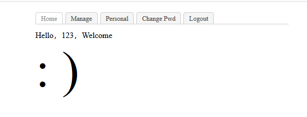

对着页面一通乱点，点到manage页面提示说你不是个admin。

### 二. 分析

回到登陆界面，发现有个findpw的功能，找回密码，也就是会先验证你的身份，然后修改密码。我们可以通过这里的缺陷修改admin的密码，以获得admin权限查看manage页面的功能。

如下图所示，我们点击findpw，

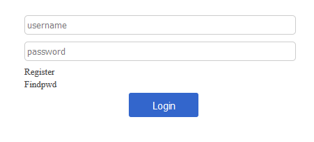

验证身份后修改密码：

修改密码的时候使用burp抓包，如下图所示：

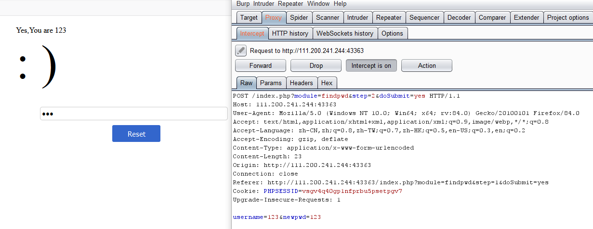

所以这个时候我们修改username=admin，将admin的密码修改为123:

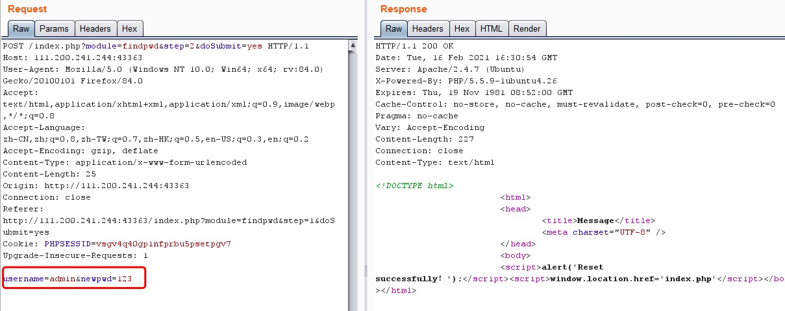

退出后我们回到登陆界面，以admin的身份登陆，点击manage，弹出下面的错误：

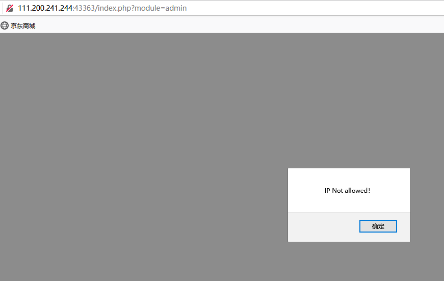

这个时候我们回到burp中，抓包添加XFF=127.0.0.1:

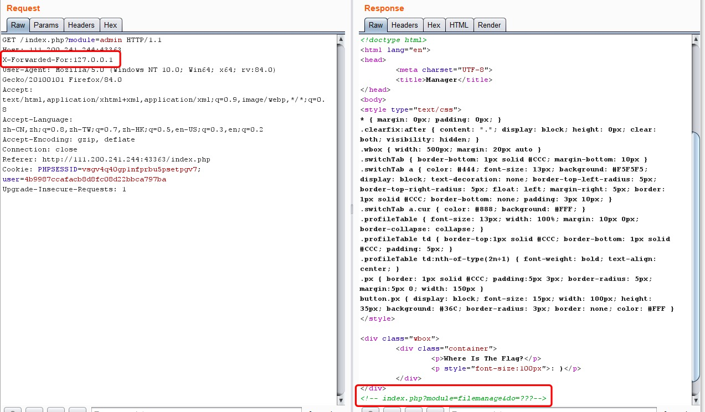

查看返回包的内容，提示了一个url，module=filename，在这里想到文件上传，然后我们让do=upload，出现下面的界面：

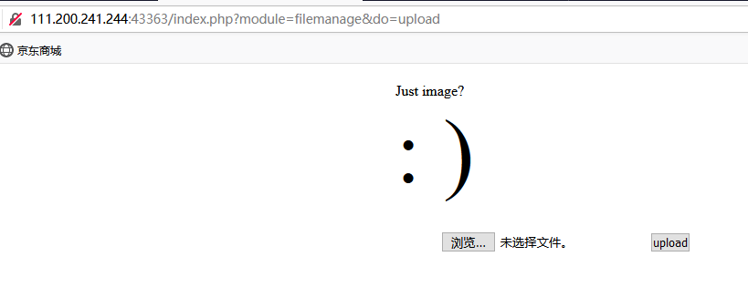

提示我们上传一个image文件，这里应该是文件上传漏洞，我们需要上传一个php文件，随便写的一个php代码，以.jpg后缀命名后上传，提示下面的错误：

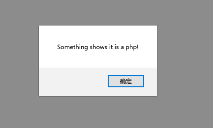

貌似不能直接用php代码，别的writeup说要这样写：

``

写完之后要修改后缀为.jpg，上传，得到下面的信息：

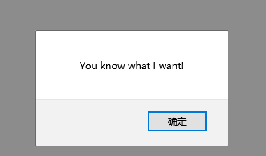

走到这一步突然反应过来好像要先用burp抓包将.jpg后缀修改为.php才行：

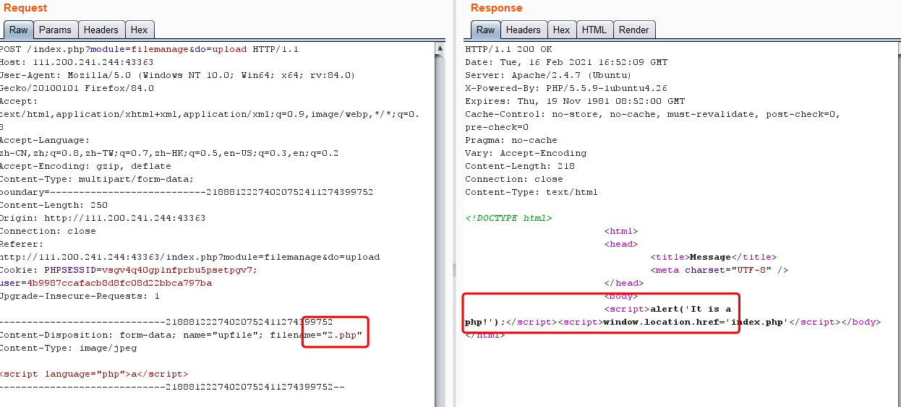

返回的内容提示说他是一个php文件，我们将php改成php5就行了：

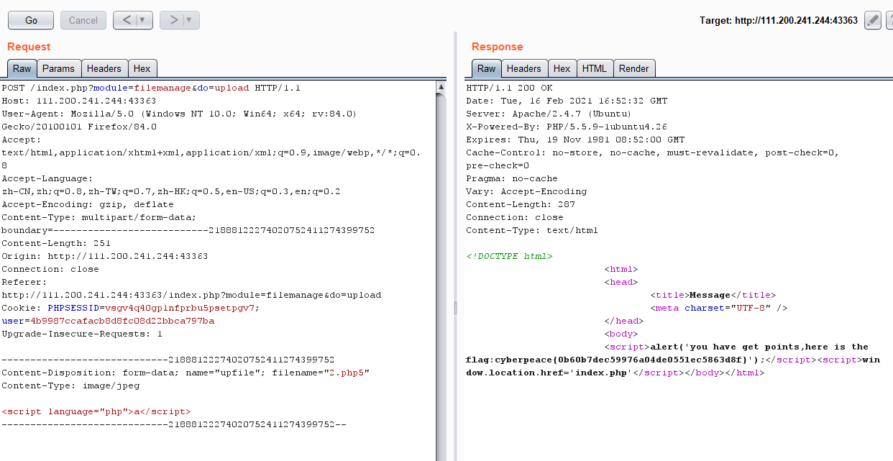

最后找到了我们要的flag。