> 题目来源：攻防世界 web 高手进阶区 easytornado
>
> 待办事项：
>
> - [ ] SSTI模版注入
> - [ ] tornado的cookie获取：handler.settings对象

一. 题目描述

如下图所示：

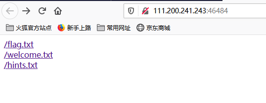

有三个文件，依次点开：

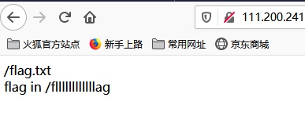

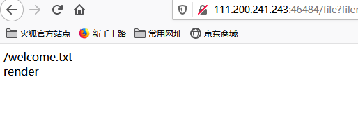

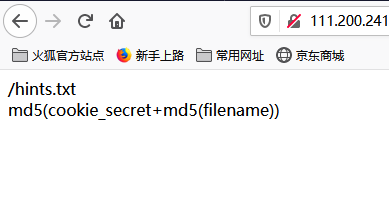

二. 分析

- 首先，flag.txt文件提示flag在/fllllllag文件中，所以我们要构造的东西如下图格式构成：

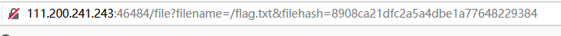

filename我们知道了，filehash是由hints.txt中提示的md5计算得到的，我们不知道的是cookie_secret。

cookie_secret则是由/welcome.txt那里得到的启发得到的。

- 先直接构造filename=/fllllllllllag去掉filehash，得到：

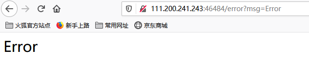

/welcome.txt中提示render，猜测可能是SSTI（服务器模板注入攻击）模版注入：

- 输入{{2}}

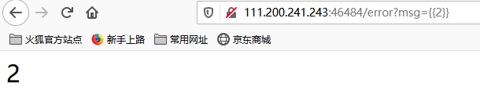

- 输入{{2*2}}返回ORZ，说明操作符被过滤了。

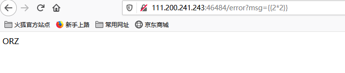

- 预备知识：

使用handler.settings对象，通过模板注入拿到tornado中的cookie：

所以我们在msg参数中输入{{handler.settings}}，得到了cookie_secret：

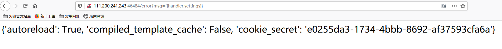

- 最后一步就是得到md5值：

md5(cookie_secret+md5(filename))=f955b629506fee95324f8b9950cbefac

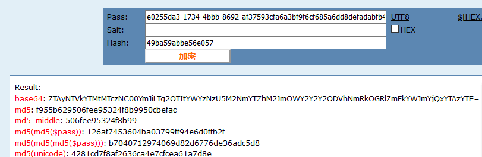

- 在url中传参，最终得到flag：

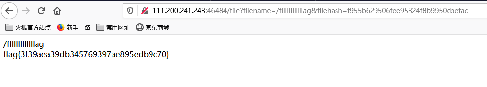

flag{3f39aea39db345769397ae895edb9c70}

