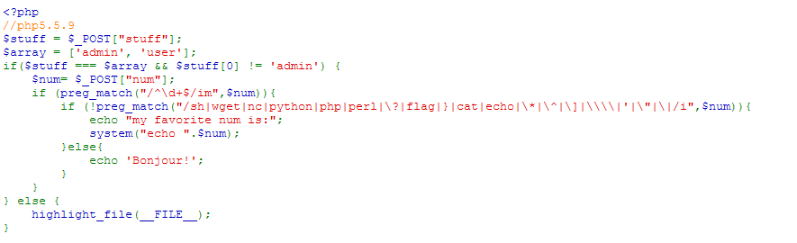
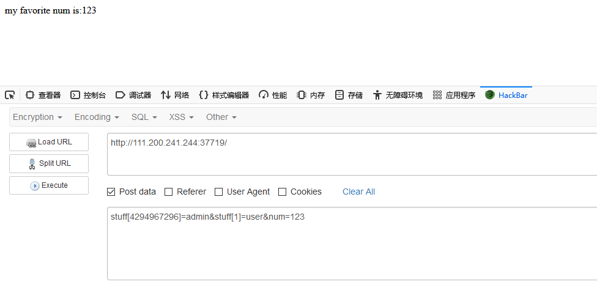
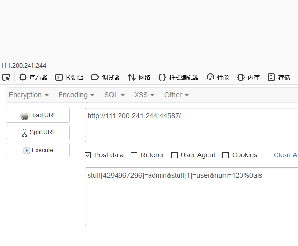
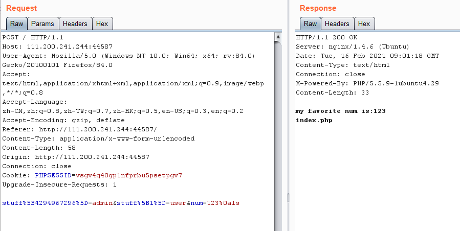
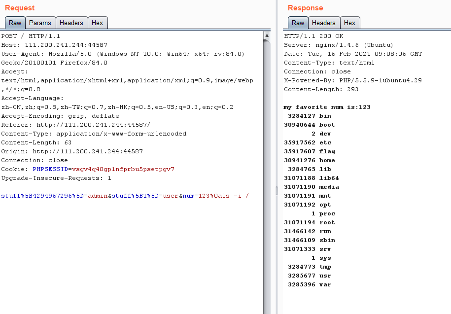
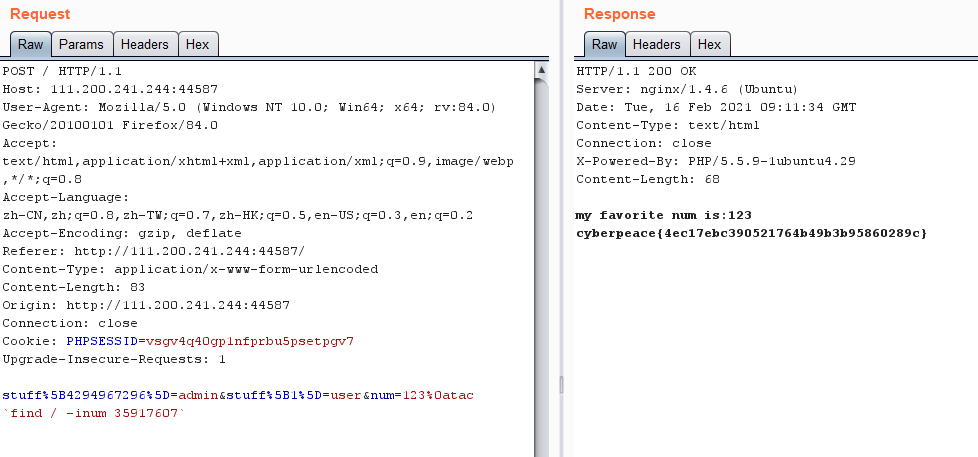

## 一. 题目描述

这是一段php代码，在本题中我们要用post方法提交两个参数stuff和num，并且stuff和num要满足一定的绕过条件才行。

1. stuff既要满足设定的数组条件也要满足首元素不相等。

2. 要求num全是数字，大小写不敏感，跨行检测。

   -i：表示不区分大小写

   -m：表示多行匹配

3. 最后是个黑名单，把常用的都排除了，num中不可以包含flag字样。

如果绕过了上述的检测，那么就可以通过传入的num参数执行系统命令system。

## 二. 分析

- 首先分析第一个绕过，有数组的key溢出问题：

  （这个数字是特定的2^32）

  于是可以构造payload：`stuff[4294967296]=admin&stuff[1]=user&num=123`

  

  

- 然后第二个条件可以使用换行符%0a绕过，如下图所示：

  

  使用burpsuite对包进行修改转发，得到如下图所示的结果：

  

  接下来：执行`ls -i /`，这个命令会显示出文件的inode号，inode存储文件的详细信息。因为代码中的绕过中num不能包含flag字样，所以使用inode号显示出flag。

  

  最后得到flag文件的内容：

  

  

  使用`绕过单双引号检测。tac命令跟cat命令一样都是输出文件的内容，cat是从第一行开始按照顺序输出文件内容，而tac是从最后一行开始倒序输出文件内容。

